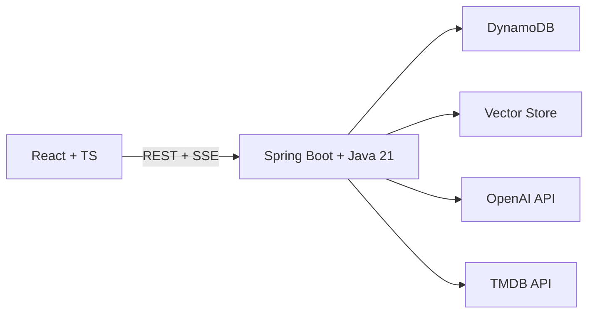

# Not Another Rewatch 🎬🍿

Stop rewatching the same stuff. Let AI find you something new.

> **Status:** Early development - [see the roadmap](docs/spec/phase-plan.md)

---

### What It Does

🔍 **Semantic search** - "heist movies with dark humor" returns real results, not keyword matches

💬 **AI movie chat** - "something like Inception but funnier" gets grounded recommendations

📊 **Track & discover** - rate movies, build a watchlist, see your taste evolve over time

### Why I'm Building This

Every night, same story. I get home from work and college, heat up dinner, sit down, open Netflix... and begin the sacred 45-minute ritual of scrolling through every streaming app known to mankind. By the time I finally pick something, my food is cold, my motivation is gone, and I've settled on The Office for the 47th time.

I did the math. I spend more time *choosing* what to watch than actually watching it. That's not a hobby, that's a part-time job with no pay and terrible benefits.

So I'm building the app I wish existed - one where I can say "give me something like Interstellar but less crying" and actually get a good answer. Not "you watched Breaking Bad, here's a cooking show." Real recommendations that understand vibes, not just genres.

### Architecture



### Tech Stack

| | Technology |
|-|-----------|
| Frontend | React 18, TypeScript, Vite, TanStack Query, Tailwind, shadcn/ui |
| Backend | Java 21, Spring Boot 3.5, Spring AI, AWS SDK v2 |
| Database | DynamoDB - [single-table design](docs/research/research-dynamodb-design.md) |
| AI | OpenAI embeddings + chat, vector similarity search |
| Data | 45K+ movies from [Kaggle](https://www.kaggle.com/datasets/rounakbanik/the-movies-dataset) + TMDB API enrichment |

### Getting Started

```bash
# Clone and set up
git clone <repo-url>
cd not-another-rewatch

# Start the dev environment (DynamoDB via LocalStack)
cd infra/docker && docker compose up -d && cd ../..

# Backend (requires Java 21 - managed by mise)
cd backend && ./gradlew bootRun

# Frontend
cd frontend && npm install && npm run dev
```

**Prerequisites:** Docker, Node 18+, Java 21 (auto-managed via [mise](https://mise.jdx.dev/))

### Key Design Decisions

- **DynamoDB single-table** - one query returns a movie with all its cast, crew, and genres using the adjacency list pattern. No JOINs needed.
- **AI replaces full-text search** - DynamoDB can't do text search, so we use embeddings for semantic search instead. "Movies about existential dread in suburbia" just works.
- **Graceful degradation** - every AI feature has a non-AI fallback. The app works fully without OpenAI.

### License

MIT
