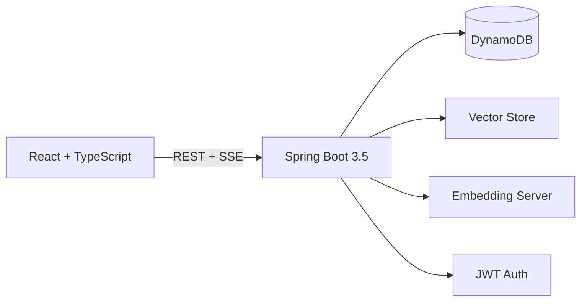

<p align="center">
  <h1 align="center">🎬 Not Another Rewatch</h1>
  <p align="center">
    <em>Because you've seen Friends enough times.</em>
    <br/>
    <strong>AI-powered movie discovery that actually gets you.</strong>
  </p>
</p>

<p align="center">
  
  
  
  
  
</p>

---

## 🤔 The Problem

Every night, same ritual. Open Netflix. Scroll for 45 minutes. Pick Friends again. Food gets cold. Dreams die quietly.

## 💡 The Solution

An app where you say *"dark crime thriller with plot twists"* and it actually understands what you mean. Not keyword matching. Not "because you watched Breaking Bad, here's a cooking show." Real, semantic understanding of movie vibes.

---

## ✨ What You Can Do

| | Feature | How It Works |
|---|---------|-------------|
| 🔍 | **Semantic Search** | "movies about existential dread in space" → Interstellar #1 |
| 💬 | **AI Chat** | Streaming recommendations with clickable poster cards |
| ⭐ | **Rate & Track** | 5-star ratings, watchlist, personal stats dashboard |
| 🧠 | **Similar Movies** | Every movie page shows AI-picked recommendations |
| 🌙 | **Dark/Light Mode** | Because your eyes matter at 2am |
| ⌨️ | **Keyboard First** | Press `/` to search from anywhere |

---

## 🏗️ How It's Built



> **Zero paid APIs.** The entire AI pipeline runs locally on CPU. No OpenAI key, no cloud ML service, no surprise bills.

| Layer | Technology |
|-------|-----------|
| Frontend | React 18, TypeScript, Vite, TanStack Query, Tailwind CSS |
| Backend | Java 21, Spring Boot 3.5, Spring Security, JWT |
| Database | DynamoDB (single-table design, 2 tables, 3 GSIs) |
| AI/ML | sentence-transformers all-MiniLM-L6-v2 (384-dim, free, local) |
| Data | 45K+ movies from [Kaggle](https://www.kaggle.com/datasets/rounakbanik/the-movies-dataset) + TMDB poster enrichment |
| Infra | Docker Compose, LocalStack, GitHub Actions CI |

---

## 🚀 Get It Running

```bash
git clone https://github.com/sandeepdanda/not-another-rewatch.git
cd not-another-rewatch

# 1. Fire up DynamoDB
cd infra/docker && docker compose up -d && cd ../..

# 2. Load movies (posters + embeddings included)
cd etl && pip install -r requirements.txt && ./setup.sh && cd ..

# 3. Start the brains (terminal 1)
cd etl && python embedding_server.py

# 4. Start the backend (terminal 2)
cd backend && ./gradlew bootRun

# 5. Start the frontend (terminal 3)
cd frontend && npm install && npm run dev
```

Open **localhost:5173** → search "movies about time travel" → enjoy.

**You'll need:** Docker, Node 18+, Java 21 ([mise](https://mise.jdx.dev/) handles this), Python 3.10+

---

## 🎯 Design Philosophy

**1. DynamoDB single-table design** — One query, one movie, all its data. Cast, crew, genres, everything. No JOINs, no N+1 problems.

**2. AI that doesn't cost money** — sentence-transformers runs on your CPU. 384 dimensions, 80MB model, zero API calls.

**3. Break gracefully** — Embedding server down? Falls back to title search. No auth token? Browse freely. Every feature degrades, nothing crashes.

**4. Stream everything** — Chat responses arrive word-by-word via SSE. Swap in Groq or OpenAI later with a one-line change.

---

## 🧩 Project Structure

```
not-another-rewatch/
├── frontend/       React 18 + TypeScript + Tailwind
├── backend/        Spring Boot 3.5 + Spring Security
├── etl/            Data pipeline + embedding server
├── infra/docker/   Docker Compose + LocalStack
├── docs/           Phase plan + design decisions
└── data/           Pre-computed movie embeddings
```

---

<p align="center">
  <em>Made with ❤️ and more caffeine than medically advisable</em>
  <br/>
  <em>No movies were rewatched in the making of this app 🍿</em>
</p>
