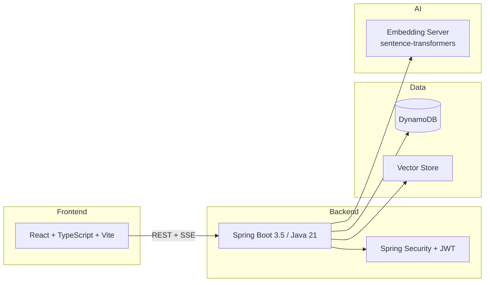

# Not Another Rewatch 🎬🍿

Stop rewatching the same stuff. Let AI find you something new.

> **Status:** Feature complete. All 11 phases shipped.

---

## What It Does

🔍 **Semantic search** - "heist movies with dark humor" returns real results, not keyword matches

💬 **AI movie chat** - describe what you're in the mood for, get streaming recommendations with poster cards

📊 **Personal stats** - rate movies, build a watchlist, see your genre breakdown and rating distribution

🌙 **Dark/Light mode** - toggle between themes

## Features

- Browse 45K+ movies with real TMDB posters
- Filter by genre, decade, sort by rating or popularity
- Title search with instant dropdown results (press `/` to focus)
- Semantic search powered by sentence-transformers (free, local, no API key)
- AI chat with SSE streaming and clickable movie cards
- Similar movies on every detail page (cosine similarity)
- JWT auth with register/login
- Watchlist and 5-star ratings stored in DynamoDB
- Stats dashboard with rating distribution and top genres
- Toast notifications, loading spinners, dark/light mode

## Architecture



## Tech Stack

| Layer | Technology |
|-------|-----------|
| Frontend | React 18, TypeScript, Vite, TanStack Query, Tailwind CSS |
| Backend | Java 21, Spring Boot 3.5, Spring Security, JWT |
| Database | DynamoDB (single-table design, 2 tables, 3 GSIs) |
| AI/ML | sentence-transformers all-MiniLM-L6-v2 (384-dim, free, local) |
| Data | 45K+ movies from [Kaggle](https://www.kaggle.com/datasets/rounakbanik/the-movies-dataset) + TMDB poster enrichment |
| Infra | Docker Compose, LocalStack, GitHub Actions CI |

## Getting Started

```bash
git clone https://github.com/sandeepdanda/not-another-rewatch.git
cd not-another-rewatch

# Start DynamoDB (LocalStack)
cd infra/docker && docker compose up -d && cd ../..

# Load test data (10 movies with posters and embeddings)
cd etl && pip install -r requirements.txt && ./setup.sh && cd ..

# Start embedding server (terminal 1)
cd etl && python embedding_server.py

# Start backend (terminal 2, requires Java 21)
cd backend && ./gradlew bootRun

# Start frontend (terminal 3)
cd frontend && npm install && npm run dev
```

Open `localhost:5173` and start browsing.

**Prerequisites:** Docker, Node 18+, Java 21 (auto-managed via [mise](https://mise.jdx.dev/)), Python 3.10+

## Key Design Decisions

- **DynamoDB single-table** - one query returns a movie with all its cast, crew, and genres. No JOINs.
- **Free local embeddings** - sentence-transformers runs on CPU, no API key needed. Same model for document and query embedding.
- **Graceful degradation** - semantic search falls back to title search if the embedding server is down.
- **SSE streaming** - chat responses stream word-by-word, ready for real LLM integration (Groq/OpenAI drop-in).

## Project Structure

```
not-another-rewatch/
├── backend/          # Spring Boot 3.5, Java 21
├── frontend/         # React 18, TypeScript, Vite
├── etl/              # Python data pipeline + embedding server
├── infra/docker/     # Docker Compose + LocalStack
├── docs/spec/        # Phase plan and design docs
├── learning/         # TIL entries and concepts
└── data/             # Pre-computed embeddings
```

## Roadmap

See [phase-plan.md](docs/spec/phase-plan.md) for the full roadmap. All 11 phases complete.

**Future ideas:** Real LLM chat (Groq/OpenAI), Letterboxd import, Redis cache, cloud deploy (Render + Vercel), full 45K movie embeddings.

## License

MIT
