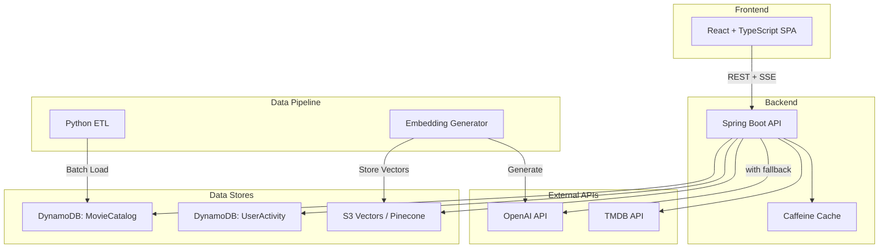

# Not Another Rewatch - System Design

## 1. Architecture Overview



### Component Descriptions

| Component | Technology | Purpose |
|-----------|-----------|---------|
| React SPA | React 18, TypeScript, Vite, TanStack Query | Movie browsing, search, chat, personal tracking |
| Spring Boot API | Java 21, Spring Boot 3.4, Spring AI | REST endpoints, AI orchestration, auth, caching |
| MovieCatalog | DynamoDB (single-table) | All movie data: metadata, cast, crew, genres |
| UserActivity | DynamoDB (separate table) | User profiles, watchlists, ratings, diary entries |
| Vector Store | S3 Vectors or Pinecone | Movie embeddings for semantic search + recommendations |
| Caffeine Cache | In-process Java cache | Hot movie data, AI responses |
| Python ETL | Pandas, boto3 | Transform Kaggle CSV data into DynamoDB items |
| Embedding Generator | Python + OpenAI API | Generate and store movie embeddings |

### Failure Modes

| Component | Failure | Impact | Fallback |
|-----------|---------|--------|----------|
| OpenAI API | Down or over budget | Semantic search, chat, taste profile unavailable | Title search, genre-based recs, "AI unavailable" banner |
| Vector Store | Unavailable | Similar movies and semantic search break | "Popular in same genre" for similar movies, title search for search |
| DynamoDB | Throttled | Slow responses | Caffeine cache absorbs hot reads. SDK built-in retry handles transient throttles |
| TMDB API | Down or rate limited | Enrichment job fails, no new posters | Existing data in DDB still works. Colored placeholders for missing posters |

## 2. DynamoDB Schema Design

### Table 1: MovieCatalog (Single-Table Design)

**Primary Key:** PK (String) + SK (String)

| Entity | PK | SK | Attributes |
|--------|----|----|-----------|
| Movie metadata | `MOVIE#<id>` | `#METADATA` | title, overview, releaseDate, budget, revenue, runtime, popularity, voteAvg, voteCount, tagline, status, posterUrl |
| Movie genre | `MOVIE#<id>` | `GENRE#<name>` | genreId, genreName |
| Movie cast | `MOVIE#<id>` | `CAST#<order>#<personId>` | personName, character, castOrder |
| Movie crew | `MOVIE#<id>` | `CREW#<dept>#<personId>` | personName, department, job |
| Movie company | `MOVIE#<id>` | `COMPANY#<companyId>` | companyName, country |
| Person metadata | `PERSON#<id>` | `#METADATA` | name, birthDate, biography |

**GSI1 - Entity Lookup (INCLUDE projection: title, releaseYear, voteAvg, popularity, posterUrl):**

| Access Pattern | GSI1PK | GSI1SK |
|---------------|--------|--------|
| Movies by genre | `GENRE#<name>` | `<releaseYear>#<movieId>` |
| Person filmography | `PERSON#<id>` | `<releaseYear>#<movieId>` |
| Movies by decade | `DECADE#<decade>` | `<popularity>#<movieId>` |

**GSI2 - Rating Sort (INCLUDE projection: title, releaseYear, voteAvg, popularity, posterUrl):**

| Access Pattern | GSI2PK | GSI2SK |
|---------------|--------|--------|
| Top rated movies | `STATUS#Released` | `<voteAvg>#<movieId>` |

Note: "Most popular" queries use GSI1 with `DECADE#` partitions (already sorted by popularity). GSI2 is only for rating sort.

### Table 2: UserActivity

**Primary Key:** PK (String) + SK (String)

| Entity | PK | SK | Attributes |
|--------|----|----|-----------|
| User profile | `USER#<id>` | `#PROFILE` | email, displayName, passwordHash, createdAt |
| Rating | `USER#<id>` | `RATING#<movieId>` | rating, ratedAt, movieTitle |
| Watchlist item | `USER#<id>` | `WATCHLIST#<addedDate>#<movieId>` | movieTitle, addedAt |
| Diary entry | `USER#<id>` | `DIARY#<watchDate>#<movieId>` | movieTitle, notes, rating, rewatchFlag |

**GSI3 - Email Lookup (KEYS_ONLY projection):**

| Access Pattern | GSI3PK | GSI3SK |
|---------------|--------|--------|
| Find user by email (for login) | `EMAIL#<email>` | `#PROFILE` |

Only `#PROFILE` items populate this GSI (sparse index). Used during login to find user ID from email.

### Access Pattern Matrix

| # | Pattern | Table/Index | Query |
|---|---------|-------------|-------|
| AP1 | Movie by ID (full) | MovieCatalog PK | `PK = MOVIE#id` |
| AP2 | Movies by genre | GSI1 | `GSI1PK = GENRE#name` |
| AP3 | Person filmography | GSI1 | `GSI1PK = PERSON#id` |
| AP4 | Movie cast/crew only | MovieCatalog PK | `PK = MOVIE#id, SK begins_with CAST or CREW` |
| AP5 | Movies by decade | GSI1 | `GSI1PK = DECADE#d` |
| AP6 | User watchlist | UserActivity PK | `PK = USER#id, SK begins_with WATCHLIST#` |
| AP7 | User ratings | UserActivity PK | `PK = USER#id, SK begins_with RATING#` |
| AP8 | Semantic search | Vector Store | Embedding similarity query |
| AP9 | Title search | In-memory index | Prefix match on title |
| AP10 | Find user by email | GSI3 | `GSI3PK = EMAIL#email` |

### Capacity Planning

| Table | Items | Storage | Mode |
|-------|-------|---------|------|
| MovieCatalog (base) | ~1.5M | ~1.5 GB | On-demand |
| MovieCatalog (GSIs) | ~1.2M | ~500 MB | With table |
| UserActivity | Grows with users | <100 MB initially | On-demand |
| Total | ~2.7M | ~2.1 GB | ~$1-2/month |

Note: ~45K movies x ~25 items each = ~1.1M items, plus ~100K person items.

## 3. API Design

### Base URL: `/api/v1`

### Movies

```
GET  /movies                    Browse movies (paginated)
     ?genre=Action              Filter by genre
     ?decade=1990               Filter by decade
     ?sort=rating|popularity    Sort order
     ?cursor=<token>            Pagination cursor
     ?limit=20                  Page size (max 100)

GET  /movies/{id}               Movie details (metadata + cast + crew + genres)
GET  /movies/{id}/similar       Similar movies (vector similarity, falls back to same-genre)

GET  /genres                    List all genres
GET  /persons/{id}              Person details + filmography
```

### Search

```
GET  /search?q=<query>          Title prefix search
GET  /search/semantic?q=<query> AI semantic search (falls back to title search if AI unavailable)
```

### AI

```
POST /chat                      Movie discovery chat (SSE streaming)
     Body: { "message": "...", "sessionId": "..." }
     Response: SSE stream with events:
       event: token    data: {"content": "I recommend ", "movieId": null}
       event: token    data: {"content": "The Grand Budapest Hotel", "movieId": "122917"}
       event: done     data: {"sessionId": "abc123"}
       event: error    data: {"message": "AI service unavailable"}
```

### Auth

```
POST /auth/register             Create account { "email": "...", "password": "..." }
POST /auth/login                Login, returns { "accessToken": "..." } + refresh cookie
POST /auth/refresh              Refresh access token (reads refresh cookie)
```

### User (authenticated)

```
GET    /me/watchlist            User's watchlist
POST   /me/watchlist/{movieId}  Add to watchlist
DELETE /me/watchlist/{movieId}  Remove from watchlist

GET    /me/ratings              User's ratings
POST   /me/ratings/{movieId}    Rate a movie { "rating": 8.5 }
PUT    /me/ratings/{movieId}    Update rating

GET    /me/diary                User's watch diary
POST   /me/diary                Log a watch { "movieId": "...", "watchDate": "...", "notes": "..." }
DELETE /me/diary/{entryId}      Delete diary entry

GET    /me/stats                User stats
GET    /me/taste                AI taste profile (falls back to genre summary)
GET    /me/recommendations      Personalized recs (falls back to popular in top genres)
```

### Infrastructure

```
GET  /health                    Health check with DDB connectivity status
```

### Auth Rules

| Endpoint Group | Auth Required |
|---------------|--------------|
| Movies, Persons, Genres, Search | No (public) |
| AI Chat, Similar Movies | No (public) |
| Watchlist, Ratings, Diary, Stats, Taste, Recs | Yes (JWT) |
| Auth endpoints | No |

### Error Response Format

```json
{
  "error": "NOT_FOUND",
  "message": "Movie with id 999999 not found",
  "status": 404
}
```

## 4. AI Pipeline Design

### Embedding Generation (offline, batch)

```
Per movie input: "{title}. {overview}. Genres: {genres}. Director: {director}. Cast: {top5_cast}."
Model: text-embedding-3-small (1536 dimensions)
Cost: ~$1-2 for ~45K movies
Storage: 45K vectors x 1536 dims x 4 bytes = ~275 MB
```

### Semantic Search (runtime)

```
User query -> embed query (OpenAI) -> find 20 nearest neighbors (vector store) -> batch-get from DDB -> return
Latency: ~200ms (embed) + ~100ms (vector search) + ~50ms (DDB) = ~350ms
Fallback: if OpenAI/vector store fails, return title search results instead
```

### RAG Chat (runtime, streaming)

```
User message -> semantic search for relevant movies -> build context with movie data -> OpenAI chat completion (streaming) -> SSE to frontend
System prompt: movie expert, must reference real movies with IDs, only discuss movies
Model: gpt-4o-mini
Conversation memory: last 10 messages in-memory (1h TTL)
Fallback: if OpenAI fails, return "Movie chat is temporarily unavailable" error event
```

### AI Cost Model

| Feature | Per-Use Cost | Monthly Estimate |
|---------|-------------|-----------------|
| Semantic search | ~$0.00002/query | ~$0.20 (10K queries) |
| Chat completion | ~$0.002/turn | ~$1.00 (500 turns) |
| Embedding generation | ~$1-2 one-time | $0 ongoing |
| Vector storage | ~$2-5/month | ~$3.00 |
| Total | | ~$4-5/month |

## 5. Frontend Architecture

### Route Structure

```
/                       Home (popular movies)
/browse                 Browse with filters
/movies/:id             Movie detail
/search?q=...           Search results
/person/:id             Person filmography
/login                  Login page
/register               Register page
/profile                User profile (watchlist, ratings, diary tabs)
/profile/stats          Personal stats dashboard
*                       404 page
```

### State Management

| State Type | Tool | Examples |
|-----------|------|---------|
| Server state | TanStack Query | Movie data, search results, user watchlist |
| Client UI state | Zustand | Theme, chat panel visibility |
| URL state | TanStack Router | Search query, filters, pagination cursor |
| Auth state | React Context | Current user, access token in memory |

### Key Patterns

- Error boundaries at app level and per-feature level
- Every data-fetching page has: loading (skeleton), error (retry button), empty (helpful message) states
- Images: TMDB size variants (w185 for grid, w342 for detail), native `loading="lazy"`, colored placeholder fallback
- Virtual threads enabled in Spring Boot (`spring.threads.virtual.enabled: true`)
- Spring AI prompt templates in `src/main/resources/prompts/`

## 6. Security Design

### JWT Strategy

- **Access token (1h):** Stored in React state (memory). Lost on page refresh, recovered via refresh token. Sent as `Authorization: Bearer <token>` header.
- **Refresh token (7d):** Stored in httpOnly cookie. Sent automatically by browser. Used only for `POST /auth/refresh`.
- **Why this split:** Access token in memory is immune to XSS. Refresh token in httpOnly cookie is immune to JavaScript access. Best of both worlds without complexity.

### CORS Configuration

```
Allowed origins: http://localhost:5173, https://not-another-rewatch.vercel.app
Allowed methods: GET, POST, PUT, DELETE
Allow credentials: true (needed for httpOnly refresh cookie)
```

### Security Checklist

- Passwords: BCrypt, min 8 characters
- CORS: frontend origins only
- Input validation: Bean Validation on all request DTOs
- Secrets: all in environment variables, `.env.example` documents them (no values)
- OpenAI: $20/month hard spending limit set in dashboard

## 7. Infrastructure

### Docker Compose (local development)

```yaml
services:
  localstack:
    image: localstack/localstack
    ports: ["4566:4566"]
    environment:
      SERVICES: dynamodb,s3

  backend:
    build: ./backend
    ports: ["8080:8080"]
    environment:
      AWS_ENDPOINT: http://localstack:4566
      OPENAI_API_KEY: ${OPENAI_API_KEY}
    depends_on: [localstack]

  frontend:
    build: ./frontend
    ports: ["5173:5173"]
    environment:
      VITE_API_URL: http://localhost:8080
```

### Production Deployment

| Component | Platform | Cost |
|-----------|---------|------|
| Frontend | Vercel (free tier) | $0 |
| Backend | Render (free or $7/month) | $0-7 |
| DynamoDB | AWS (on-demand, ~2GB) | $1-2 |
| Vector Store | S3 Vectors or Pinecone free tier | $0-5 |
| OpenAI API | Pay per use | $4-5 |
| Total | | ~$5-20/month |

## 8. Technology Decision Log

| Decision | Chosen | Why (not just what) |
|----------|--------|-----|
| React + Vite (not Next.js) | Separate Java backend makes SSR unnecessary. Vite is faster for SPA dev. No SEO needed (app is behind auth for personal features) |
| Spring Boot 3.4 (not Quarkus) | Most mature Java framework. Spring AI for OpenAI. Virtual threads solve async. Matches work stack |
| DynamoDB (not Postgres) | Learning goal. Single-table design is a valuable skill. Free tier is generous. Forces access-pattern-first thinking |
| On-demand capacity (not provisioned) | Simpler. No capacity planning. Cost is negligible at personal project scale. Avoids throttling surprises |
| OpenAI (not Bedrock/local models) | Best embeddings quality/cost. Spring AI has first-class support. gpt-4o-mini is cheap. Works outside AWS |
| Caffeine (not Redis) | In-process is simplest. No extra infra. Sufficient for single-instance. Add Redis only if needed |
| JWT custom (not Clerk/Auth0) | Learning exercise. Spring Security + JWT is a valuable skill. No external dependency or cost |
| Tailwind + shadcn/ui (not MUI) | Smallest bundle. Full design control for cinematic movie UI. Source code you own, not a dependency |
| TanStack Query (not SWR) | Best infinite scroll support. Best devtools. Structural sharing for performance |
