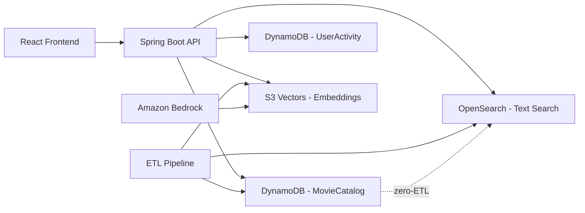

# DynamoDB Design Research: Movie Database

> Research date: 2026-04-09
> Context: Migrating a 600K+ movie PostgreSQL database to DynamoDB with a Java Spring Boot backend and React+TS frontend.

## Executive Summary

This document covers DynamoDB data modeling for a movie database with complex many-to-many relationships (movies-genres, movies-persons, movies-companies, movies-countries). The current PostgreSQL schema uses 12 tables in 3NF with junction tables for all relationships.

**Key recommendations:**
1. Use a **hybrid approach** - a primary single table for core movie data with vertical partitioning, plus a separate table for user-specific data (watchlists, ratings)
2. Use **adjacency list pattern** for many-to-many relationships (movie-cast, movie-genre)
3. Use **3 overloaded GSIs** to cover all 8 access patterns
4. Handle the **400KB limit** via vertical partitioning (split movie metadata from cast/crew items)
5. Use **Amazon S3 Vectors** (or OpenSearch) as a sidecar for AI embeddings - DynamoDB cannot do similarity search natively
6. Use **DynamoDB zero-ETL integration with OpenSearch** for full-text search

---

## Table of Contents

1. [Current Relational Schema](#1-current-relational-schema)
2. [Access Patterns Analysis](#2-access-patterns-analysis)
3. [Single-Table vs Multi-Table Decision](#3-single-table-vs-multi-table-decision)
4. [DynamoDB Table Design](#4-dynamodb-table-design)
5. [Many-to-Many Relationship Modeling](#5-many-to-many-relationship-modeling)
6. [GSI Overloading Strategy](#6-gsi-overloading-strategy)
7. [Handling the 400KB Item Limit](#7-handling-the-400kb-item-limit)
8. [AI Embeddings and Vector Search](#8-ai-embeddings-and-vector-search)
9. [Full-Text Search Strategy](#9-full-text-search-strategy)
10. [Item Examples](#10-item-examples)
11. [Cost and Capacity Considerations](#11-cost-and-capacity-considerations)
12. [Sources](#sources)

---

## 1. Current Relational Schema

```
movies (id, title, overview, release_date, budget, revenue, runtime, status, popularity, vote_avg, vote_count, tagline, homepage)
genres (id, name)
persons (id, name, birth_date, biography)
languages (id, name, code)
companies (id, name, country)
countries (id, name, iso_code)
ratings (id, movie_id, user_id, rating, rated_at)

-- Junction tables (many-to-many)
movie_genres (movie_id, genre_id)
movie_cast (movie_id, person_id, character_name, cast_order)
movie_crew (movie_id, person_id, department, job)
movie_languages (movie_id, language_id, language_role_id)
movie_companies (movie_id, company_id)
movie_countries (movie_id, country_id)
```

**Key stats:**
- ~600K movies, ~100K persons, ~20 genres, ~200 languages, ~50K companies
- Average movie has: 3 genres, 10 cast members, 8 crew members, 2 languages, 3 companies
- Largest movies: 50+ cast, 100+ crew members

---

## 2. Access Patterns Analysis

| # | Access Pattern | Key Attributes | Frequency | Latency Need |
|---|---------------|---------------|-----------|-------------|
| AP1 | Get movie by ID with all details | movieId | Very High | < 10ms |
| AP2 | List movies by genre (paginated) | genreName, releaseYear | High | < 50ms |
| AP3 | Get actor/director filmography | personId | High | < 50ms |
| AP4 | Get movie cast and crew | movieId | High | < 10ms |
| AP5 | Browse movies by decade/year | decade or year | Medium | < 100ms |
| AP6 | User watchlist and ratings | userId | Medium | < 50ms |
| AP7 | Search results (text search) | query string | High | < 200ms |
| AP8 | Similar movies / recommendations | movieId or embedding | Medium | < 500ms |

**Analysis:**
- AP1 and AP4 are the hottest paths - both keyed on movieId, always fetched together
- AP2, AP3, AP5 need GSIs with different partition keys
- AP6 is user-specific data with different write patterns than movie catalog data
- AP7 requires full-text search (not a DynamoDB strength - needs OpenSearch sidecar)
- AP8 requires vector similarity search (needs S3 Vectors or similar sidecar)

---

## 3. Single-Table vs Multi-Table Decision

### What AWS recommends

AWS docs now present three approaches equally (not just single-table):
- **Single-table design** - composite sort keys, overloaded GSIs, adjacency lists. Best when entities have high access correlation and similar operational characteristics.
- **Multi-table design** - separate tables for entities with independent operational requirements. Simpler to understand and manage.
- **Aggregate design** - embed related data when always accessed together.

> "The choice between single-table and multi-table design depends on your specific requirements. Single-table design works well when entities have high access correlation and similar operational characteristics. Multi-table design is preferred when entities have independent operational requirements, different access patterns, or when you need clear operational boundaries."
> - AWS DynamoDB Developer Guide

### Decision for movie database: Hybrid (2 tables)

| Factor | Movie Catalog Data | User Data (watchlists, ratings) |
|--------|-------------------|-------------------------------|
| Write pattern | Rare (bulk ETL loads) | Frequent (user actions) |
| Read pattern | Very high, read-heavy | Medium, per-user |
| Access correlation | Movie + cast + genres always together | User + their ratings together |
| Capacity mode | Provisioned (predictable) | On-demand (spiky) |
| Data lifecycle | Permanent | User-dependent |

**Table 1: `MovieCatalog`** (single-table design)
- All movie entities: movies, genres, persons, cast, crew, companies, countries
- Read-heavy, rarely written, high access correlation between entities
- Single-table design makes sense here because displaying a movie page needs movie + cast + genres in one query

**Table 2: `UserActivity`** (separate table)
- Watchlists, user ratings, viewing history
- Different write patterns (frequent small writes vs rare bulk loads)
- Different capacity needs (on-demand vs provisioned)
- Clean operational boundary - user data shouldn't affect movie catalog performance

---

## 4. DynamoDB Table Design

### Table 1: MovieCatalog

**Primary Key:**
- PK (Partition Key): Entity identifier (e.g., `MOVIE#12345`, `PERSON#678`)
- SK (Sort Key): Relationship or detail type (e.g., `#METADATA`, `CAST#001#Tom Hanks`)

**Entity types stored in this table:**

| Entity Type | PK | SK | Purpose |
|------------|----|----|---------|
| Movie metadata | `MOVIE#<id>` | `#METADATA` | Core movie info (title, overview, dates, stats) |
| Movie genre | `MOVIE#<id>` | `GENRE#<genreName>` | Genre association |
| Movie cast | `MOVIE#<id>` | `CAST#<order>#<personId>` | Cast member with ordering |
| Movie crew | `MOVIE#<id>` | `CREW#<department>#<personId>` | Crew member by department |
| Movie company | `MOVIE#<id>` | `COMPANY#<companyId>` | Production company |
| Movie country | `MOVIE#<id>` | `COUNTRY#<isoCode>` | Production country |
| Movie language | `MOVIE#<id>` | `LANG#<role>#<code>` | Language with role |
| Person metadata | `PERSON#<id>` | `#METADATA` | Person info (name, bio, birth_date) |
| Person filmography | `PERSON#<id>` | `FILM#<releaseYear>#<movieId>` | Reverse lookup for filmography |

**Why this key design works:**
- `Query(PK = "MOVIE#12345")` returns ALL movie data in one call (AP1 + AP4)
- `Query(PK = "MOVIE#12345", SK begins_with "CAST#")` returns just the cast (AP4)
- `Query(PK = "PERSON#678", SK begins_with "FILM#")` returns filmography sorted by year (AP3)
- Cast ordering is preserved in the sort key (`CAST#001#...`, `CAST#002#...`)

### Table 2: UserActivity

**Primary Key:**
- PK: `USER#<userId>`
- SK: Activity type (e.g., `RATING#<movieId>`, `WATCHLIST#<movieId>`)

| Entity Type | PK | SK | Purpose |
|------------|----|----|---------|
| User rating | `USER#<userId>` | `RATING#<movieId>` | User's rating for a movie |
| Watchlist item | `USER#<userId>` | `WATCHLIST#<addedDate>#<movieId>` | Watchlist sorted by date added |
| User profile | `USER#<userId>` | `#PROFILE` | User preferences, display name |

---

## 5. Many-to-Many Relationship Modeling

### The adjacency list pattern

AWS recommends the **adjacency list pattern** for many-to-many relationships in DynamoDB. The idea: all top-level entities use the partition key, and relationships are items within the partition using the sort key as the target entity ID.

For the movie database, every many-to-many relationship from the relational schema maps to items within a movie's partition:

```
-- Movie #12345 has genres: Action, Sci-Fi
PK=MOVIE#12345, SK=GENRE#Action       → {genreName: "Action", genreId: 28}
PK=MOVIE#12345, SK=GENRE#Sci-Fi       → {genreName: "Sci-Fi", genreId: 878}

-- Movie #12345 has cast: Tom Hanks, Meg Ryan
PK=MOVIE#12345, SK=CAST#001#31        → {personName: "Tom Hanks", character: "Joe Fox", personId: 31}
PK=MOVIE#12345, SK=CAST#002#5344      → {personName: "Meg Ryan", character: "Kathleen Kelly", personId: 5344}
```

### Reverse lookups via denormalization

The adjacency list gives us movie→genre and movie→person lookups. For the reverse (genre→movies, person→movies), we have two options:

**Option A: GSI inversion (recommended for person→movies)**
- Create a GSI where the sort key becomes the partition key
- GSI1: PK=`GSI1PK`, SK=`GSI1SK` where person filmography items set `GSI1PK=PERSON#<id>`, `GSI1SK=<releaseYear>#<movieId>`
- This is the standard "inverted index" pattern from AWS docs

**Option B: Denormalized reverse items (recommended for genre→movies)**
- Write a separate item under the person's partition: `PK=PERSON#31, SK=FILM#1998#12345`
- Denormalized data: store movie title and year on the filmography item to avoid a second lookup
- Trade-off: more writes during ETL, but reads are single-query

**For this project, we use both:**
- Person filmography: denormalized reverse items under `PERSON#<id>` partition (AP3 is a hot path)
- Genre→movies: GSI with genre as partition key (AP2 needs pagination across many movies)

### Denormalization trade-offs

| Approach | Reads | Writes | Consistency | Best for |
|----------|-------|--------|-------------|----------|
| Adjacency list only | 1 query per direction | 1 write | Strong | Low-cardinality relationships |
| Adjacency + GSI | 1 query per direction | 1 write + GSI propagation | Eventually consistent on GSI | High-cardinality, read-heavy |
| Denormalized reverse items | 1 query per direction | 2 writes (both directions) | Strong both directions | Hot read paths, rarely-changing data |

For a movie catalog loaded via ETL (writes are rare, reads are constant), denormalization cost is negligible.

---

## 6. GSI Overloading Strategy

DynamoDB allows up to 20 GSIs per table, but best practice is to use as few as possible via **GSI overloading** - storing different attribute types in the same GSI key attributes depending on the item type.

### MovieCatalog GSIs

#### GSI1: Entity Lookup Index
- **GSI1PK**: Overloaded - contains `GENRE#<name>`, `PERSON#<id>`, `DECADE#<decade>`, or `YEAR#<year>`
- **GSI1SK**: Overloaded - contains sort criteria relevant to the entity type

| Access Pattern | GSI1PK | GSI1SK | Notes |
|---------------|--------|--------|-------|
| AP2: Movies by genre | `GENRE#Action` | `<releaseYear>#<movieId>` | Paginate with SK, newest first |
| AP3: Person filmography | `PERSON#31` | `<releaseYear>#<movieId>` | Sorted by year |
| AP5: Movies by decade | `DECADE#1990` | `<popularity>#<movieId>` | Top movies in decade |
| AP5: Movies by year | `YEAR#1994` | `<popularity>#<movieId>` | Top movies in year |

**How it works:** Each item in the MovieCatalog table sets `GSI1PK` and `GSI1SK` based on its type:
- A `GENRE#Action` item on movie #12345 sets `GSI1PK=GENRE#Action`, `GSI1SK=1998#12345`
- A `CAST#001#31` item sets `GSI1PK=PERSON#31`, `GSI1SK=1998#12345`
- The `#METADATA` item sets `GSI1PK=YEAR#1998`, `GSI1SK=45.67#12345` (popularity-sorted)

This single GSI serves access patterns AP2, AP3, and AP5.

#### GSI2: Popularity/Rating Index
- **GSI2PK**: `STATUS#Released` (or other status values)
- **GSI2SK**: `<voteAvg>#<movieId>` or `<popularity>#<movieId>`

| Access Pattern | GSI2PK | GSI2SK | Notes |
|---------------|--------|--------|-------|
| Top rated movies | `STATUS#Released` | `<voteAvg>#<movieId>` | Global top-rated |
| Most popular movies | `STATUS#Released` | `<popularity>#<movieId>` | Global trending |

#### GSI3 (on UserActivity table): Movie Ratings Lookup
- **GSI3PK**: `MOVIE#<movieId>`
- **GSI3SK**: `RATING#<rating>#<userId>`

| Access Pattern | GSI3PK | GSI3SK | Notes |
|---------------|--------|--------|-------|
| AP6: All ratings for a movie | `MOVIE#12345` | `RATING#...` | Aggregate ratings |
| AP6: User's rating for movie | Query UserActivity PK directly | - | Direct lookup |

### Sparse index optimization

Not every item needs every GSI attribute. DynamoDB GSIs are **sparse by default** - items without the GSI key attributes are simply not indexed. This saves storage and write costs:
- Only `#METADATA` items populate GSI2 (movie-level attributes)
- Only genre/cast/crew items populate GSI1 (relationship items)
- Person `#METADATA` items don't need GSI1 (they're looked up by PK directly)

---

## 7. Handling the 400KB Item Limit

### Size estimation for movie items

| Component | Avg Size | Max Size | Notes |
|-----------|----------|----------|-------|
| Movie metadata item | ~2 KB | ~5 KB | title, overview, dates, stats, tagline |
| Genre item | ~100 B | ~200 B | genre name + IDs |
| Cast item | ~300 B | ~500 B | person name, character, order |
| Crew item | ~250 B | ~400 B | person name, department, job |
| Company item | ~200 B | ~300 B | company name, country |
| Country/Language item | ~100 B | ~200 B | name, code |

**Total per movie (all items in partition):**
- Average movie: 2KB + (3 x 100B) + (10 x 300B) + (8 x 250B) + (3 x 200B) + (3 x 100B) = ~7.5 KB
- Large movie (50 cast, 100 crew): 5KB + (5 x 200B) + (50 x 500B) + (100 x 400B) + (5 x 300B) + (5 x 200B) = ~73 KB

**No single item approaches 400KB.** The vertical partitioning inherent in the adjacency list pattern already solves the size problem - each relationship is its own item.

### Three strategies from AWS docs (for reference)

1. **Vertical partitioning** (what we're already doing)
   - Break large items into smaller items sharing the same PK, differentiated by SK
   - Each cast member, genre, etc. is its own item
   - Query the full partition to reassemble, or query specific SK prefixes

2. **Compression**
   - Compress large text attributes (overview, biography) using GZIP
   - Store as Binary type
   - Trade-off: compressed values can't be filtered server-side
   - For this project: overview text is typically < 1KB, not worth compressing

3. **S3 offloading**
   - Store large blobs (images, full biographies) in S3, reference by URL in DynamoDB
   - For this project: movie poster URLs are already just URLs (not binary data)
   - Use for: full biography text if it exceeds a few KB

### Recommendation for this project

The adjacency list pattern naturally keeps every item well under 400KB. No special handling needed. If biography text for persons gets large (some actors have 10KB+ bios), store the full bio in S3 and keep a truncated version (first 500 chars) in DynamoDB for display.

---

## 8. AI Embeddings and Vector Search

### The problem

DynamoDB has **no native vector similarity search**. You can store embeddings as a list of numbers, but you can't query "find the 10 most similar movies to movie X" without scanning the entire table and computing distances client-side. That's not viable for 600K movies.

### Options evaluated

| Option | Latency | Cost | Complexity | Best For |
|--------|---------|------|-----------|----------|
| **Amazon S3 Vectors** | Sub-second (100-500ms) | Very low (pay per use) | Low | Infrequent queries, cost-sensitive |
| **Amazon OpenSearch** | < 50ms | Medium-high (cluster) | Medium | High-QPS, hybrid text+vector search |
| **Pinecone** | < 50ms | Medium (managed) | Low | Pure vector workloads |
| **pgvector (Aurora)** | < 100ms | Medium (instance) | Medium | Already using PostgreSQL |
| **DynamoDB + client-side** | Seconds | Low | High | Tiny datasets only |

### Recommendation: Amazon S3 Vectors

For a personal/portfolio project with a movie database:

**Why S3 Vectors:**
- **Cost**: Pay only for storage + queries. No cluster to run. Up to 90% cheaper than dedicated vector DBs.
- **Scale**: Each vector index can hold tens of millions of vectors. 600K movies is well within limits.
- **Metadata filtering**: Attach genre, year, rating as metadata. Query "similar to movie X, but only Action movies from the 2000s."
- **No infrastructure**: No servers, no clusters, no capacity planning.
- **AWS-native**: Integrates with Bedrock for embedding generation.

**How it works for movie recommendations (AP8):**

```
1. During ETL: Generate embeddings for each movie using Amazon Bedrock (Titan Embed Text v2)
   - Input: "{title}. {overview}. Genres: {genres}. Cast: {top_cast}."
   - Output: 1024-dimensional vector

2. Store in S3 Vectors:
   - Vector bucket: "movie-embeddings"
   - Vector index: "movies"
   - Each vector: key=movieId, vector=[...], metadata={genre, year, rating, title}

3. At query time (AP8 - similar movies):
   - Look up movie's embedding from S3 Vectors (or cache it)
   - Query S3 Vectors: "find 20 nearest neighbors, filter by genre=Action"
   - Return movie IDs, then batch-get details from DynamoDB
```

**Architecture diagram:**



### What NOT to do

- Don't store 1024-float vectors in DynamoDB items. A single embedding is ~4KB (1024 x 4 bytes). It wastes RCUs on every read and you can't search it.
- Don't try to build approximate nearest neighbor search in DynamoDB with clever key schemes. It doesn't work for high-dimensional vectors.
- Don't use pgvector if you're migrating away from PostgreSQL. That defeats the purpose.

---

## 9. Full-Text Search Strategy

### The problem

DynamoDB supports exact match and `begins_with` on sort keys, but not full-text search. AP7 (search results) needs fuzzy matching, multi-field search, and relevance ranking.

### Recommendation: DynamoDB zero-ETL with OpenSearch Service

AWS offers a **zero-ETL integration** between DynamoDB and OpenSearch that automatically syncs data without building custom pipelines:

1. **Initial sync**: Point-in-Time Recovery (PITR) export loads existing data
2. **Ongoing sync**: DynamoDB Streams pushes changes to OpenSearch in near real-time

**What OpenSearch adds:**
- Multi-field search (search across title, overview, cast names, genre simultaneously)
- Fuzzy matching (typo tolerance: "Godfathr" finds "The Godfather")
- Relevance scoring and ranking
- Faceted navigation (filter by genre, decade, rating range)
- Semantic search via Bedrock integration (natural language queries)

**For a portfolio project**, OpenSearch Serverless is the simplest option. For cost-sensitive development, you could also:
- Use OpenSearch only for search, DynamoDB for everything else
- Start without OpenSearch and add it later (the zero-ETL integration is non-invasive)
- Use a simpler approach: maintain a search index in-memory on the Spring Boot server for development, swap to OpenSearch for production

### Alternative: Client-side search for MVP

For initial development, skip OpenSearch entirely:
- Load movie titles + IDs into an in-memory trie or prefix index on the Spring Boot server
- Use DynamoDB `begins_with` queries on a title GSI for basic prefix search
- Add OpenSearch later when you need fuzzy matching and relevance ranking

---

## 10. Item Examples

### MovieCatalog table - "The Godfather" (movieId: 238)

```json
// Movie metadata
{
  "PK": "MOVIE#238",
  "SK": "#METADATA",
  "title": "The Godfather",
  "overview": "Spanning the years 1945 to 1955, a chronicle of the fictional...",
  "releaseDate": "1972-03-14",
  "budget": 6000000,
  "revenue": 245066411,
  "runtime": 175,
  "status": "Released",
  "popularity": 94.43,
  "voteAvg": 8.7,
  "voteCount": 18200,
  "tagline": "An offer you can't refuse.",
  "GSI1PK": "YEAR#1972",
  "GSI1SK": "94.43#238",
  "GSI2PK": "STATUS#Released",
  "GSI2SK": "8.70#238",
  "entityType": "MOVIE"
}

// Genre items
{
  "PK": "MOVIE#238",
  "SK": "GENRE#Crime",
  "genreId": 80,
  "genreName": "Crime",
  "GSI1PK": "GENRE#Crime",
  "GSI1SK": "1972#238",
  "entityType": "MOVIE_GENRE"
}

{
  "PK": "MOVIE#238",
  "SK": "GENRE#Drama",
  "genreId": 18,
  "genreName": "Drama",
  "GSI1PK": "GENRE#Drama",
  "GSI1SK": "1972#238",
  "entityType": "MOVIE_GENRE"
}

// Cast items
{
  "PK": "MOVIE#238",
  "SK": "CAST#001#3084",
  "personId": 3084,
  "personName": "Marlon Brando",
  "character": "Don Vito Corleone",
  "castOrder": 1,
  "GSI1PK": "PERSON#3084",
  "GSI1SK": "1972#238",
  "entityType": "MOVIE_CAST"
}

{
  "PK": "MOVIE#238",
  "SK": "CAST#002#1158",
  "personId": 1158,
  "personName": "Al Pacino",
  "character": "Michael Corleone",
  "castOrder": 2,
  "GSI1PK": "PERSON#1158",
  "GSI1SK": "1972#238",
  "entityType": "MOVIE_CAST"
}

// Crew item
{
  "PK": "MOVIE#238",
  "SK": "CREW#Directing#1776",
  "personId": 1776,
  "personName": "Francis Ford Coppola",
  "department": "Directing",
  "job": "Director",
  "GSI1PK": "PERSON#1776",
  "GSI1SK": "1972#238",
  "entityType": "MOVIE_CREW"
}
```

### Query examples (Java SDK pseudocode)

```java
// AP1 + AP4: Get movie with all details (single query)
QueryRequest.builder()
    .tableName("MovieCatalog")
    .keyConditionExpression("PK = :pk")
    .expressionAttributeValues(Map.of(":pk", "MOVIE#238"))
    .build();
// Returns: metadata + all genres + all cast + all crew + companies + countries

// AP2: Movies by genre, newest first (GSI1)
QueryRequest.builder()
    .tableName("MovieCatalog")
    .indexName("GSI1")
    .keyConditionExpression("GSI1PK = :genre")
    .expressionAttributeValues(Map.of(":genre", "GENRE#Action"))
    .scanIndexForward(false)  // newest first
    .limit(20)
    .build();

// AP3: Actor filmography (GSI1)
QueryRequest.builder()
    .tableName("MovieCatalog")
    .indexName("GSI1")
    .keyConditionExpression("GSI1PK = :person")
    .expressionAttributeValues(Map.of(":person", "PERSON#3084"))
    .scanIndexForward(false)  // newest first
    .build();

// AP5: Movies by decade, sorted by popularity (GSI1)
QueryRequest.builder()
    .tableName("MovieCatalog")
    .indexName("GSI1")
    .keyConditionExpression("GSI1PK = :decade")
    .expressionAttributeValues(Map.of(":decade", "DECADE#1970"))
    .scanIndexForward(false)  // most popular first
    .limit(50)
    .build();

// AP6: User's watchlist (UserActivity table)
QueryRequest.builder()
    .tableName("UserActivity")
    .keyConditionExpression("PK = :user AND begins_with(SK, :prefix)")
    .expressionAttributeValues(Map.of(
        ":user", "USER#42",
        ":prefix", "WATCHLIST#"
    ))
    .scanIndexForward(false)  // most recently added first
    .build();
```

---

## 11. Cost and Capacity Considerations

### Storage estimate

| Data | Items | Avg Size | Total |
|------|-------|----------|-------|
| Movie metadata | 600K | 2 KB | 1.2 GB |
| Genre items | 1.8M (600K x 3) | 100 B | 180 MB |
| Cast items | 6M (600K x 10) | 300 B | 1.8 GB |
| Crew items | 4.8M (600K x 8) | 250 B | 1.2 GB |
| Company items | 1.8M (600K x 3) | 200 B | 360 MB |
| Country/Lang items | 1.8M (600K x 3) | 100 B | 180 MB |
| Person metadata | 100K | 500 B | 50 MB |
| **Total base table** | **~16.3M items** | - | **~5 GB** |
| GSI1 (projected) | ~14.4M | ~200 B | ~2.9 GB |
| GSI2 (projected) | ~600K | ~150 B | ~90 MB |
| **Total with GSIs** | - | - | **~8 GB** |

DynamoDB storage: $0.25/GB/month = ~$2/month for the catalog table.

### Capacity mode recommendation

- **MovieCatalog**: Provisioned mode. Read-heavy, predictable traffic. Start with 100 RCU / 10 WCU (writes only during ETL). Use auto-scaling.
- **UserActivity**: On-demand mode. Unpredictable, spiky user traffic. Pay per request.

### ETL write cost

Loading 16.3M items at 25 WCU per item (1KB avg):
- On-demand: 16.3M x $1.25 per million WRU = ~$20 one-time
- Provisioned: Temporarily increase to 5000 WCU, load in ~1 hour, then scale back

### Read cost for common patterns

| Pattern | Items Read | RCU (eventual) | Cost per 1M requests |
|---------|-----------|----------------|---------------------|
| AP1: Movie + all details | ~25 items, ~7.5KB | 1 RCU | $0.125 |
| AP2: 20 movies by genre | 20 items, ~4KB | 1 RCU | $0.125 |
| AP3: Filmography (20 movies) | 20 items, ~4KB | 1 RCU | $0.125 |

At these sizes, reads are extremely cheap. Most queries consume 1-2 RCUs with eventual consistency.

---

## Access Pattern Coverage Summary

| # | Access Pattern | Table/Index | Query Strategy |
|---|---------------|-------------|---------------|
| AP1 | Movie by ID + details | MovieCatalog (PK) | `Query PK=MOVIE#id` |
| AP2 | Movies by genre | GSI1 | `Query GSI1PK=GENRE#name` |
| AP3 | Actor/director filmography | GSI1 | `Query GSI1PK=PERSON#id` |
| AP4 | Movie cast and crew | MovieCatalog (PK) | `Query PK=MOVIE#id, SK begins_with CAST\|CREW` |
| AP5 | Movies by decade/year | GSI1 | `Query GSI1PK=DECADE#d or YEAR#y` |
| AP6 | User watchlist/ratings | UserActivity (PK) | `Query PK=USER#id` |
| AP7 | Text search | OpenSearch (sidecar) | Zero-ETL from DynamoDB |
| AP8 | Similar movies | S3 Vectors (sidecar) | Similarity query + DynamoDB batch-get |

---

## Sources

- [Best practices for storing large items and attributes in DynamoDB](https://docs.aws.amazon.com/amazondynamodb/latest/developerguide/bp-use-s3-too.html) - accessed 2026-04-09
- [Best practices for managing many-to-many relationships (adjacency lists)](https://docs.aws.amazon.com/amazondynamodb/latest/developerguide/bp-adjacency-graphs.html) - accessed 2026-04-09
- [Overloading Global Secondary Indexes in DynamoDB](https://docs.aws.amazon.com/amazondynamodb/latest/developerguide/bp-gsi-overloading.html) - accessed 2026-04-09
- [First steps for modeling relational data in DynamoDB](https://docs.aws.amazon.com/amazondynamodb/latest/developerguide/bp-modeling-nosql.html) - accessed 2026-04-09
- [Best practices for using secondary indexes in DynamoDB](https://docs.aws.amazon.com/amazondynamodb/latest/developerguide/bp-indexes.html) - accessed 2026-04-09
- [Multi-attribute keys pattern](https://docs.aws.amazon.com/amazondynamodb/latest/developerguide/GSI.DesignPattern.MultiAttributeKeys.html) - accessed 2026-04-09
- [SQL to NoSQL: Modeling data in Amazon DynamoDB (AWS Blog)](https://aws.amazon.com/blogs/database/sql-to-nosql-modeling-data-in-amazon-dynamodb/) - accessed 2026-04-09
- [Working with S3 Vectors and vector buckets](https://docs.aws.amazon.com/AmazonS3/latest/userguide/s3-vectors.html) - accessed 2026-04-09
- [S3 Vectors best practices](https://docs.aws.amazon.com/AmazonS3/latest/userguide/s3-vectors-best-practices.html) - accessed 2026-04-09
- [Optimizing recommendations using DynamoDB and S3 Vectors (AWS Blog)](https://aws.amazon.com/blogs/storage/using-amazon-dynamodb-and-amazon-s3-for-optimized-recommendations-and-analytics/) - accessed 2026-04-09
- [Implementing search on DynamoDB data using zero-ETL with OpenSearch (AWS Blog)](https://aws.amazon.com/blogs/database/implementing-search-on-amazon-dynamodb-data-using-zero-etl-integration-with-amazon-opensearch-service/) - accessed 2026-04-09
- [Using S3 Vectors for semantic search in a media lake (AWS Blog)](https://aws.amazon.com/blogs/media/using-amazon-s3-vectors-preview-to-semantically-search-using-a-media-lake-on-aws/) - accessed 2026-04-09
- ⚠️ External link - [Introducing Amazon S3 Vectors (AWS News Blog)](https://aws.amazon.com/blogs/aws/introducing-amazon-s3-vectors-first-cloud-storage-with-native-vector-support-at-scale/) - accessed 2026-04-09
- [DynamoDB Constraints and Limits](https://docs.aws.amazon.com/amazondynamodb/latest/developerguide/Constraints.html) - accessed 2026-04-09
- [Data modeling building blocks in DynamoDB](https://docs.aws.amazon.com/amazondynamodb/latest/developerguide/data-modeling-blocks.html) - accessed 2026-04-09
