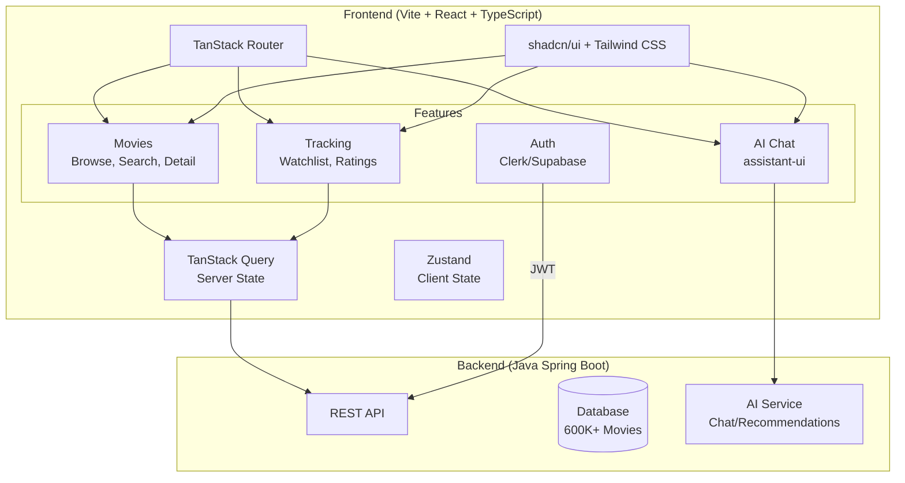

# Frontend Architecture Research - Movie Database App

> Researched 2026-04-09. Covers React + TypeScript architecture decisions for a movie database with 600K+ movies, separate Java Spring Boot backend, AI chatbot, and personal tracking/ratings.

## Executive Summary

| Decision | Recommendation | Confidence |
|----------|---------------|------------|
| Build tool | **Vite** (not Next.js) | HIGH |
| Routing | **TanStack Router** | HIGH |
| Server state | **TanStack Query** | HIGH |
| Client state | **Zustand** | HIGH |
| UI/Styling | **Tailwind CSS + shadcn/ui** | HIGH |
| Chat UI | **assistant-ui** or custom with Vercel AI SDK patterns | MEDIUM |
| Auth | **Clerk** (fastest) or **Supabase Auth** (cheapest) | MEDIUM |
| Testing | **Vitest + React Testing Library + Playwright** | HIGH |

---

## 1. Vite vs Next.js

### Why Vite wins for this project

The backend is a separate Java Spring Boot API. Next.js's main advantages (SSR, API routes, server components) are irrelevant here. This is a classic SPA behind authentication with no SEO needs.

| Factor | Vite | Next.js |
|--------|------|---------|
| Dev server cold start | 1-2s | 3-5s (Turbopack) |
| HMR speed | <50ms | 100-300ms |
| Production bundle | ~42KB base | ~92KB base |
| Learning curve | Low | Medium-High |
| SSR/SEO | Not needed for this app | Overkill |
| API routes | Not needed (Java backend) | Unused overhead |
| Deploy target | Any static host (S3, Cloudflare Pages) | Best on Vercel |

**Key reasons:**
- No SEO requirement - the app is personal, behind auth
- Separate Java backend means Next.js API routes are wasted
- Vite's dev speed is noticeably faster for daily work
- Simpler mental model - no server/client component boundary confusion
- Vitest shares Vite's config, making test setup trivial
- Can deploy as static files anywhere (S3 + CloudFront, Cloudflare Pages)

**If you ever need SSR later:** TanStack Start is the Vite-native SSR framework from the same team as TanStack Router/Query. Migration path exists without switching to Next.js.

### Vite project setup

```bash
npm create vite@latest movie-database -- --template react-ts
```

---

## 2. Folder Structure & Component Patterns

The 2025-2026 consensus is a **hybrid feature-based structure**: shared reusable code in top-level folders, domain logic grouped by feature.

```
src/
├── app/                    # App shell - providers, router, global layout
│   ├── App.tsx
│   ├── providers.tsx       # QueryClient, auth, theme providers
│   └── router.tsx          # TanStack Router route tree
├── features/               # Feature modules (the core of the app)
│   ├── movies/
│   │   ├── api/            # API hooks (useMovies, useMovie, useSearchMovies)
│   │   ├── components/     # MovieCard, MovieGrid, MovieDetail, MovieFilters
│   │   ├── hooks/          # Feature-specific hooks
│   │   ├── types.ts        # Movie, Genre, SearchParams types
│   │   └── index.ts        # Public API barrel export
│   ├── chat/
│   │   ├── api/
│   │   ├── components/     # ChatWindow, MessageBubble, ChatInput
│   │   ├── hooks/
│   │   └── types.ts
│   ├── tracking/
│   │   ├── api/
│   │   ├── components/     # WatchlistButton, RatingStars, WatchHistory
│   │   ├── hooks/
│   │   └── types.ts
│   └── auth/
│       ├── components/
│       └── hooks/
├── components/             # Shared UI components (not feature-specific)
│   └── ui/                 # shadcn/ui components live here
├── hooks/                  # Shared hooks (useDebounce, useIntersectionObserver)
├── lib/                    # Utilities, API client config, constants
│   ├── api-client.ts       # Axios/fetch wrapper for Java backend
│   └── utils.ts
├── stores/                 # Zustand stores (client state)
│   └── ui-store.ts         # Sidebar state, theme, etc.
└── types/                  # Shared/global types
    └── api.ts              # API response wrappers, pagination types
```

### Key principles

- **Colocation**: keep related files together. A feature's API hooks, components, and types live in the same folder.
- **Barrel exports**: each feature has an `index.ts` that controls its public API. Other features import from `features/movies`, not from deep paths.
- **shadcn/ui components** go in `components/ui/` - this is the default shadcn convention and keeps generated components separate from custom ones.
- **No `utils/` dumping ground** - if a utility is feature-specific, it lives in that feature folder.

### Component patterns

- **Functional components only** - no class components in 2026
- **Named exports** over default exports (better refactoring, better tree-shaking)
- **Props interfaces** defined inline or co-located:

```tsx
interface MovieCardProps {
  movie: Movie;
  onRate?: (rating: number) => void;
}

export function MovieCard({ movie, onRate }: MovieCardProps) {
  // ...
}
```

- **Custom hooks** to extract logic from components - keeps components focused on rendering
- **Compound components** for complex UI (e.g., `<MovieFilters>` with `<MovieFilters.Genre>`, `<MovieFilters.Year>`)

---

## 3. Server State Management: TanStack Query vs SWR vs RTK Query

### Comparison

| Feature | TanStack Query | SWR | RTK Query |
|---------|---------------|-----|-----------|
| Infinite queries | ✅ Built-in `useInfiniteQuery` | ✅ `useSWRInfinite` | ❌ Manual |
| Bi-directional infinite | ✅ | Requires custom code | ❌ |
| Devtools | ✅ Excellent | ✅ Basic | ✅ Via Redux DevTools |
| Optimistic updates | ✅ | Requires custom code | ✅ |
| Query cancellation | ✅ | ❌ | ❌ |
| Auto garbage collection | ✅ | ❌ | ✅ |
| Stale time config | ✅ | ❌ (immutable mode only) | ✅ |
| Offline mutation support | ✅ | ❌ | ❌ |
| Selectors | ✅ | ❌ | ✅ |
| Structural sharing | ✅ Full | Identity only | Identity only |
| Window focus refetch | ✅ | ✅ | ✅ |
| Suspense support | ✅ | ✅ | ❌ |
| Bundle size | ~13KB | ~4KB | Requires Redux (~11KB+) |
| TypeScript | Excellent | Good | Excellent |
| Requires Redux | No | No | Yes |

### Recommendation: TanStack Query

For a movie database with 600K+ movies, TanStack Query is the clear winner:

1. **`useInfiniteQuery`** is purpose-built for infinite scroll movie grids - handles page params, caching across pages, and refetching automatically
2. **Structural sharing** means re-renders only happen when data actually changes - critical for large lists
3. **Devtools** are the best in class - inspect cache, trigger refetches, simulate errors
4. **Query key system** maps perfectly to movie API patterns: `['movies', { genre, year, sort }]`
5. **Prefetching** - hover over a movie card, prefetch its detail page data
6. **Optimistic updates** for ratings/watchlist - instant UI feedback while the Java backend processes

**SWR** is lighter (~4KB) but lacks infinite query refetching, selectors, and garbage collection. Good for simple apps, not enough for this one.

**RTK Query** requires Redux as a dependency. Adding Redux for server state when TanStack Query handles it standalone is unnecessary complexity.

### Pattern: API hooks with TanStack Query

```tsx
// features/movies/api/use-movies.ts
export function useMovies(filters: MovieFilters) {
  return useInfiniteQuery({
    queryKey: ['movies', filters],
    queryFn: ({ pageParam = 0 }) =>
      apiClient.get<MoviePage>('/api/movies', {
        params: { ...filters, page: pageParam },
      }),
    getNextPageParam: (lastPage) =>
      lastPage.hasNext ? lastPage.page + 1 : undefined,
    staleTime: 5 * 60 * 1000, // 5 min - movie data doesn't change often
  });
}
```

### Client state: Zustand

TanStack Query handles server state. For the small amount of client state (sidebar open/closed, theme, active filters in URL), use **Zustand**:
- ~1KB bundle, zero boilerplate
- TypeScript-first with v5
- No providers needed - works outside React tree
- Middleware for persistence (localStorage) and devtools
- Pairs naturally with TanStack Query (they don't overlap)

---

## 4. UI & Styling: Tailwind CSS + shadcn/ui vs Material UI

### Comparison

| Factor | shadcn/ui + Tailwind | Material UI (MUI) | Ant Design |
|--------|---------------------|-------------------|------------|
| Bundle size | ~577KB (tree-shakes aggressively) | ~1MB+ | ~1.3MB |
| npm dependencies | 0 (local source code) | 12 | 48 |
| Customization | Total - you own the source | Theme overrides, can fight the framework | Hard to not look like Ant Design |
| Accessibility | Excellent (Radix UI primitives) | Excellent | Improving, historically weaker |
| Component count | ~50 core | 70+ core + MUI X paid | 60+ all free |
| Styling approach | Tailwind utility classes | Emotion CSS-in-JS | CSS-in-JS |
| Growth trajectory | ~10x YoY | ~2.3x YoY | ~1.5x YoY |
| Learning curve | Low (if you know Tailwind) | Medium | Medium |
| Design flexibility | Any design achievable | Material Design default | Ant Design default |

### Recommendation: Tailwind CSS + shadcn/ui

For a movie browsing UI where visual design matters:

1. **Zero runtime overhead** - shadcn components are local source files, not an npm package. Ship only what you use.
2. **Movie-specific design** - you need dark themes, poster-centric layouts, cinematic feel. Tailwind gives total control. MUI would fight you with Material Design defaults.
3. **shadcn/ui provides the foundation** - Dialog, Dropdown, Tabs, Skeleton, Input, Button, Card, Sheet, Command (for search) - all accessible, all customizable.
4. **Tailwind's utility classes** are perfect for responsive movie grids: `grid grid-cols-2 sm:grid-cols-3 md:grid-cols-4 lg:grid-cols-5 xl:grid-cols-6 gap-4`
5. **Dark mode** is trivial with Tailwind's `dark:` variant
6. **Community momentum** - shadcn/ui is the default for new React projects in 2026

**What shadcn/ui doesn't have** that you might need:
- Advanced data grid (not needed for movie browsing)
- Charts (use Recharts or shadcn's chart component based on Recharts)
- Date picker (shadcn has one based on react-day-picker)

### Key shadcn/ui components for this project

```
npx shadcn@latest add button card dialog input skeleton tabs
npx shadcn@latest add dropdown-menu sheet command scroll-area
npx shadcn@latest add avatar badge separator tooltip
```

---

## 5. Movie Browsing UX Patterns

### Responsive movie poster grid

Movie posters have a standard 2:3 aspect ratio. The grid should auto-fill based on viewport width.

```tsx
// Tailwind responsive grid - auto-fills columns based on min width
<div className="grid grid-cols-2 sm:grid-cols-3 md:grid-cols-4 lg:grid-cols-5 xl:grid-cols-6 gap-4">
  {movies.map(movie => <MovieCard key={movie.id} movie={movie} />)}
</div>
```

```tsx
// MovieCard with poster aspect ratio
function MovieCard({ movie }: { movie: Movie }) {
  return (
    <div className="group relative">
      <div className="aspect-[2/3] overflow-hidden rounded-lg bg-muted">
        
      </div>
      <h3 className="mt-2 text-sm font-medium truncate">{movie.title}</h3>
      <p className="text-xs text-muted-foreground">{movie.year}</p>
    </div>
  );
}
```

### Infinite scroll with TanStack Query

```tsx
function MovieGrid({ filters }: { filters: MovieFilters }) {
  const { data, fetchNextPage, hasNextPage, isFetchingNextPage } = useMovies(filters);
  const loadMoreRef = useRef<HTMLDivElement>(null);

  // IntersectionObserver triggers fetchNextPage when sentinel enters viewport
  useEffect(() => {
    const observer = new IntersectionObserver(
      (entries) => {
        if (entries[0].isIntersecting && hasNextPage && !isFetchingNextPage) {
          fetchNextPage();
        }
      },
      { rootMargin: '200px' } // Start loading 200px before user reaches bottom
    );
    if (loadMoreRef.current) observer.observe(loadMoreRef.current);
    return () => observer.disconnect();
  }, [fetchNextPage, hasNextPage, isFetchingNextPage]);

  const movies = data?.pages.flatMap(page => page.content) ?? [];

  return (
    <>
      <div className="grid grid-cols-2 sm:grid-cols-3 md:grid-cols-4 lg:grid-cols-5 xl:grid-cols-6 gap-4">
        {movies.map(movie => <MovieCard key={movie.id} movie={movie} />)}
        {isFetchingNextPage && <MovieCardSkeletons count={6} />}
      </div>
      <div ref={loadMoreRef} />
    </>
  );
}
```

### Skeleton loading

Use shadcn's `<Skeleton>` component to show placeholder cards while data loads:

```tsx
function MovieCardSkeleton() {
  return (
    <div>
      <Skeleton className="aspect-[2/3] rounded-lg" />
      <Skeleton className="mt-2 h-4 w-3/4" />
      <Skeleton className="mt-1 h-3 w-1/4" />
    </div>
  );
}
```

### Image lazy loading

- Use native `loading="lazy"` on `` tags - supported in all modern browsers
- For above-the-fold images (first row), omit `loading="lazy"` to avoid LCP delays
- Use `aspect-[2/3]` container to prevent layout shift as images load
- Consider `srcset` for responsive poster sizes (small thumbnails in grid, large on detail page)
- **Blurhash** or **LQIP** (Low Quality Image Placeholder) for a Netflix-like blur-up effect while posters load

### Responsive design patterns

| Breakpoint | Grid columns | Card behavior |
|-----------|-------------|---------------|
| Mobile (<640px) | 2 columns | Compact cards, title truncated |
| Tablet (640-1024px) | 3-4 columns | Standard cards |
| Desktop (1024-1280px) | 5 columns | Cards with hover overlay |
| Large (1280px+) | 6 columns | Cards with hover overlay + quick actions |

### Hover interactions (desktop)

On hover over a movie card, show an overlay with:
- Rating badge
- Year and runtime
- Quick action buttons (add to watchlist, rate)
- "More info" link to detail page

```tsx
<div className="absolute inset-0 bg-black/60 opacity-0 group-hover:opacity-100 transition-opacity rounded-lg flex flex-col justify-end p-3">
  <Badge>{movie.rating}/10</Badge>
  <p className="text-white text-xs">{movie.year} · {movie.runtime}min</p>
  <div className="flex gap-2 mt-2">
    <WatchlistButton movieId={movie.id} size="sm" />
    <RatingButton movieId={movie.id} size="sm" />
  </div>
</div>
```

### Search UX

- Use shadcn's `<Command>` component (based on cmdk) for a spotlight-style search
- Debounce input by 300ms before hitting the API
- Show search suggestions as user types (movie titles, genres, actors)
- Keyboard navigation: arrow keys to select, Enter to go to movie detail

---

## 6. Chat UI for AI Chatbot

### Library options

| Library | Approach | Streaming | Markdown | Accessibility | Backend coupling |
|---------|----------|-----------|----------|---------------|-----------------|
| **assistant-ui** | Headless React primitives (Radix-style) | ✅ Built-in | ✅ Built-in | ✅ Excellent | Any backend via `ChatModelAdapter` |
| **Vercel AI SDK (`useChat`)** | React hook + stream protocol | ✅ Built-in | Manual | Manual | Expects AI SDK stream protocol |
| **Custom build** | Roll your own with SSE/WebSocket | Manual | Manual | Manual | Full control |

### Recommendation: assistant-ui

[assistant-ui](https://www.assistant-ui.com/) is the strongest option for this project:

- **Headless primitives** inspired by Radix UI - composable, accessible, fully customizable
- **Built-in features**: streaming text, auto-scroll, markdown rendering, code highlighting, retry, keyboard shortcuts
- **Works with any backend** via `ChatModelAdapter` - perfect for a custom Java backend
- **shadcn/ui compatible** - uses the same Tailwind + Radix approach
- **No Vercel lock-in** - unlike `useChat` which expects Vercel AI SDK stream protocol

### Custom backend adapter pattern

```tsx
import type { ChatModelAdapter } from "@assistant-ui/react";

const movieChatAdapter: ChatModelAdapter = {
  async *run({ messages, abortSignal }) {
    const response = await fetch("/api/chat", {
      method: "POST",
      headers: { "Content-Type": "application/json" },
      body: JSON.stringify({ messages }),
      signal: abortSignal,
    });

    const reader = response.body?.getReader();
    if (!reader) throw new Error("No response body");

    const decoder = new TextDecoder();
    let fullText = "";

    while (true) {
      const { done, value } = await reader.read();
      if (done) break;
      const chunk = decoder.decode(value, { stream: true });
      fullText += chunk;
      yield { content: [{ type: "text", text: fullText }] };
    }
  },
};
```

### Chat UI features to implement

1. **Streaming responses** - text appears token-by-token (handled by assistant-ui)
2. **Message history** - persist in localStorage or backend, load on mount
3. **Markdown rendering** - AI responses often include formatted text, lists, movie recommendations
4. **Movie card embeds** - when the AI recommends a movie, render an inline `<MovieCard>` instead of plain text
5. **Suggested prompts** - "Find me a sci-fi movie from the 90s", "What's similar to Inception?"
6. **Slide-over panel** - chat lives in a `<Sheet>` (shadcn) that slides in from the right, doesn't take over the whole page

### Alternative: Vercel AI SDK useChat

If the Java backend can implement the [AI SDK stream protocol](https://sdk.vercel.ai/docs/ai-sdk-ui/stream-protocol) (SSE with specific format), `useChat` is simpler:

```tsx
import { useChat } from "ai/react";

function ChatPanel() {
  const { messages, input, handleInputChange, handleSubmit, isLoading } = useChat({
    api: "/api/chat",
  });
  // render messages...
}
```

Downside: tighter coupling to a specific stream format. assistant-ui gives more flexibility with a custom Java backend.

---

## 7. Authentication Options

### Comparison for a personal project

| Factor | Clerk | Auth0 | Supabase Auth | JWT (DIY) |
|--------|-------|-------|---------------|-----------|
| Free tier | 10,000 MAU | 7,500 MAU | 50,000 MAU | Unlimited |
| Setup time | ~15 min | ~30 min | ~20 min | Hours |
| React SDK quality | Excellent (`<SignIn/>`, `<UserButton/>`) | Good | Good | N/A |
| Social login (Google, GitHub) | ✅ Trivial | ✅ | ✅ | Manual OAuth |
| Pre-built UI components | ✅ Beautiful, customizable | ✅ Universal Login | ❌ Build your own | ❌ |
| Vite SPA support | ✅ First-class | ✅ | ✅ | ✅ |
| Backend integration | JWT verification in Java | JWT verification | JWT verification | You build it |
| User management dashboard | ✅ Excellent | ✅ | ✅ Basic | ❌ |
| Cost at scale | ~$0.02/MAU above free | $23/mo for 1K MAU | $25/mo for 100K MAU | Free |
| Vendor lock-in | Medium | Medium | Low (open source) | None |

### Recommendation: Clerk or Supabase Auth

**For fastest development: Clerk**
- Pre-built `<SignIn>`, `<SignUp>`, `<UserButton>` components that look great out of the box
- 10,000 MAU free tier is plenty for a personal project
- Best React DX of any auth provider - works with Vite SPAs natively
- JWT tokens can be verified in the Java backend with standard JWT libraries

**For lowest cost + most flexibility: Supabase Auth**
- 50,000 MAU free tier - 5x Clerk's free tier
- Open source - can self-host if needed
- Includes a Postgres database (useful if you ever want to store user data outside Java)
- No pre-built UI components - you build login forms with shadcn/ui (more work, more control)

**Skip Auth0** - enterprise-focused, more complex setup, lower free tier than both alternatives.

**Skip DIY JWT** - building auth from scratch is a security risk and time sink for a personal project. Use a proven provider.

### Integration pattern with Java backend

Regardless of auth provider, the pattern is the same:

```
Browser → Clerk/Supabase → JWT token
Browser → Java API (Authorization: Bearer <JWT>)
Java API → Verify JWT signature with provider's public key
```

The Java backend never handles login/signup - it just validates JWT tokens on each request.

---

## 8. Testing Strategy

### The testing pyramid for React + TypeScript

```
        ╱╲
       ╱E2E╲         Playwright (3-5 critical flows)
      ╱──────╲
     ╱ Integr. ╲     React Testing Library + Vitest (component interactions)
    ╱────────────╲
   ╱    Unit      ╲   Vitest (hooks, utils, pure functions)
  ╱────────────────╲
```

### Tool choices

| Layer | Tool | Why |
|-------|------|-----|
| Unit tests | **Vitest** | Shares Vite config, native ESM/TS, 10-20x faster than Jest in watch mode |
| Component tests | **Vitest + React Testing Library** | Tests user behavior, not implementation details |
| E2E tests | **Playwright** | Multi-browser, auto-wait, best debugging tools |
| API mocking | **MSW (Mock Service Worker)** | Intercepts at network level, works in both tests and dev |

### Why Vitest over Jest

- Shares Vite's transform pipeline - no separate TypeScript/JSX config
- Native ESM support (Jest still struggles with ESM modules)
- Compatible with Jest's API - easy migration
- Watch mode is 10-20x faster
- Built-in code coverage via v8 or istanbul

### What to test

**Unit tests (Vitest)**
- Custom hooks (useDebounce, useLocalStorage)
- Utility functions (formatRuntime, buildQueryString)
- Zustand store logic
- Type guards and validators

**Component tests (React Testing Library + Vitest)**
- MovieCard renders title, year, poster
- MovieGrid shows skeleton while loading
- Search input debounces and calls API
- Rating component updates on click
- Chat input sends message on Enter

**E2E tests (Playwright) - 3-5 critical flows only**
1. Search for a movie and navigate to detail page
2. Add a movie to watchlist
3. Rate a movie
4. Send a chat message and receive a response
5. Login/logout flow

### MSW for API mocking

Mock the Java backend at the network level - works in both Vitest and Playwright:

```tsx
// mocks/handlers.ts
import { http, HttpResponse } from 'msw';

export const handlers = [
  http.get('/api/movies', ({ request }) => {
    const url = new URL(request.url);
    const page = Number(url.searchParams.get('page') ?? 0);
    return HttpResponse.json({
      content: mockMovies.slice(page * 20, (page + 1) * 20),
      hasNext: page < 5,
      page,
    });
  }),
];
```

### Test file conventions

```
src/features/movies/components/MovieCard.tsx
src/features/movies/components/MovieCard.test.tsx   # co-located
```

---

## 9. Routing: TanStack Router

TanStack Router is the recommended router for Vite SPAs in 2026. It provides end-to-end type safety that React Router lacks.

**Why TanStack Router over React Router:**
- Full TypeScript inference for route params, search params, and loaders
- File-based route generation (optional) - similar to Next.js but for Vite
- Built-in search param validation with Zod
- Integrated with TanStack Query for route-level data loading
- Code splitting per route is automatic

```tsx
// routes/movies/$movieId.tsx - type-safe route with loader
export const Route = createFileRoute('/movies/$movieId')({
  loader: ({ params }) =>
    queryClient.ensureQueryData(movieQueryOptions(params.movieId)),
  component: MovieDetailPage,
});

function MovieDetailPage() {
  const { movieId } = Route.useParams(); // fully typed
  const movie = useSuspenseQuery(movieQueryOptions(movieId));
  // ...
}
```

---

## 10. GitHub Inspiration

Real movie app repos worth studying:

| Repo | Stack | Notable patterns |
|------|-------|-----------------|
| [Valik3201/goit-react-hw-05-movies](https://github.com/Valik3201/goit-react-hw-05-movies) | React + TanStack Query + shadcn/ui + Tailwind | Closest to our target stack |
| [sudeepmahato16/movie-app](https://github.com/sudeepmahato16/movie-app) | React + TS + Tailwind | Clean movie UI, trailer playback |
| [hoanglechau/react-movie-app-ts](https://github.com/hoanglechau/react-movie-app-ts) | React + TS + MUI + TMDB | TypeScript patterns, MUI theming |
| [kd1729/movie_tmdb_react_app](https://github.com/kd1729/movie_tmdb_react_app) | React + Tailwind + Auth0 | Auth integration, favorites/watchlist |
| [mattiaz9/vite-react-tanstack-tailwind-shadcn-starter](https://github.com/mattiaz9/vite-react-tanstack-tailwind-shadcn-starter) | Vite + TanStack Router + Query + shadcn | Starter template matching our exact stack |

---

## 11. Architecture Diagram



---

## 12. Recommended Tech Stack Summary

```
Build & Dev:        Vite 6.x
Language:           TypeScript 5.x (strict mode)
Framework:          React 19.x
Routing:            TanStack Router
Server State:       TanStack Query v5
Client State:       Zustand v5
UI Components:      shadcn/ui (Radix UI primitives)
Styling:            Tailwind CSS v4
Chat UI:            assistant-ui
Auth:               Clerk (or Supabase Auth)
HTTP Client:        ky or axios
Form Handling:      React Hook Form + Zod
Unit/Component:     Vitest + React Testing Library
E2E:                Playwright
API Mocking:        MSW v2
Linting:            ESLint + typescript-eslint
Formatting:         Prettier + prettier-plugin-tailwindcss
```

---

## Sources

- [TanStack Query Comparison Table](https://tanstack.com/query/v4/docs/react/comparison) - accessed 2026-04-09
- [Vite vs Next.js: Complete Comparison (DesignRevision)](https://designrevision.com/blog/vite-vs-nextjs) - accessed 2026-04-09
- [shadcn/ui vs MUI vs Ant Design (AdminLTE)](https://adminlte.io/blog/shadcn-ui-vs-mui-vs-ant-design/) - accessed 2026-04-09
- [React UI Library Comparison: 8 Libraries, 1 Dashboard (WoodCP)](https://www.woodcp.com/2026/03/react-ui-library-comparison/) - accessed 2026-04-09
- [assistant-ui - React AI Chat Library](https://www.assistant-ui.com/) - accessed 2026-04-09
- [Vercel AI SDK useChat Reference](https://sdk.vercel.ai/docs/api-reference/use-chat) - accessed 2026-04-09
- [Clerk vs Auth0 vs Supabase (DesignRevision)](https://designrevision.com/blog/auth-providers-compared) - accessed 2026-04-09
- [TanStack Router vs React Router (BetterStack)](https://betterstack.com/community/comparisons/tanstack-router-vs-react-router/) - accessed 2026-04-09
- [Vitest vs Playwright (BrowserStack)](https://www.browserstack.com/guide/vitest-vs-playwright) - accessed 2026-04-09
- [Testing in 2026: Full-Stack Strategies (Nucamp)](https://nucamp.co/blog/testing-in-2026-jest-react-testing-library-and-full-stack-testing-strategies) - accessed 2026-04-09
- ⚠️ External link - [React Lazy Loading Images (Cloudinary)](https://cloudinary.com/guides/web-performance/react-lazy-loading-images) - accessed 2026-04-09
- [Valik3201/goit-react-hw-05-movies](https://github.com/Valik3201/goit-react-hw-05-movies) - accessed 2026-04-09
- [mattiaz9/vite-react-tanstack-tailwind-shadcn-starter](https://github.com/mattiaz9/vite-react-tanstack-tailwind-shadcn-starter) - accessed 2026-04-09
