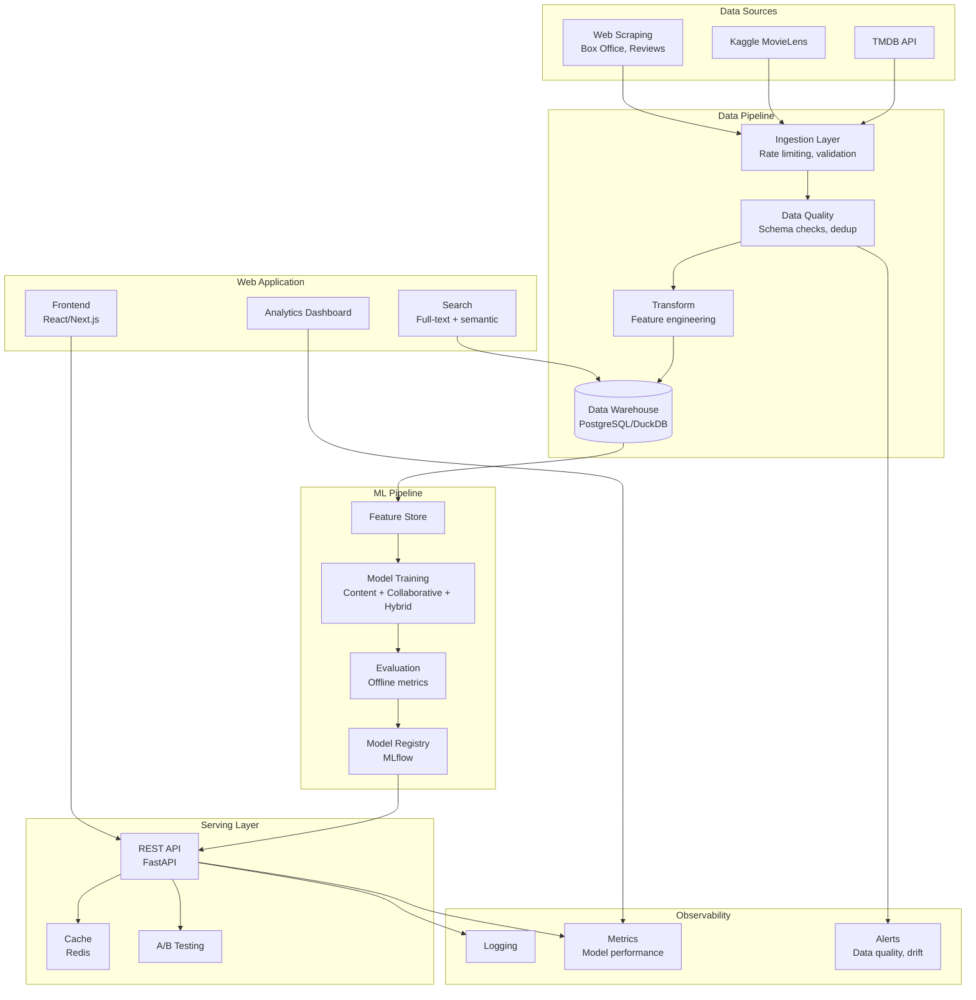

# Research: What Makes a Movie Database Project Stand Out

## Executive Summary

Most movie database projects on GitHub are forgettable - they're CRUD apps with TMDB API calls or Jupyter notebooks with basic collaborative filtering on MovieLens data. The projects that get stars and impress hiring managers share a common trait: they treat the movie domain as a vehicle to demonstrate real engineering, not as the end goal itself.

The sweet spot for a standout project is the intersection of **data engineering + web application + ML** - a combination that fewer than 5% of movie projects attempt. This document covers what works, what doesn't, and what to build.

---

## 1. Features That Get Stars and Attention on GitHub

### What actually drives stars

Based on analysis of popular movie/recommendation projects and general GitHub star patterns:

| Feature | Impact | Why It Works |
|---------|--------|-------------|
| Live demo / deployed app | Very High | People star what they can try immediately |
| Architecture diagram in README | High | Communicates scope in 5 seconds |
| Polished README with visuals | High | "A good percentage of people will star your project just because it looks good" |
| Solves a real problem (not a tutorial) | High | "The projects that get stars solve real problems" |
| Multiple ML approaches compared | Medium | Shows depth, not just copy-paste |
| Docker/docker-compose one-liner setup | Medium | Lowers barrier to trying it |
| CI/CD pipeline visible | Medium | Signals production mindset |
| Data pipeline with real data sources | Medium | Differentiates from Kaggle notebook projects |

### What the best movie projects include

From analyzing projects like [chenxi1103/Netflix-Movie-Recommendation-System](https://github.com/chenxi1103/Netflix-Movie-Recommendation-System) (26 stars, 150 commits) and similar:

- **End-to-end pipeline**: Kafka ingestion -> MongoDB -> feature extraction -> model training -> Flask API -> monitoring dashboard
- **Data quality checks**: Schema validation, deduplication, missing data handling at every stage
- **Multiple test levels**: Unit, integration, system-level, and production testing (hit rate tracking)
- **Canary deployment**: Infrastructure for incremental rollout of new model versions
- **Monitoring**: D3.js dashboard for pipeline health, model performance tracking
- **A/B testing framework**: Compare model versions with real user behavior
- **Feedback loop detection**: Identifying when recommendations create self-reinforcing patterns

### What most movie projects look like (the sea of mediocrity)

- Single Jupyter notebook with MovieLens or TMDB 5000 dataset
- Content-based filtering with TF-IDF + cosine similarity
- No tests, no deployment, no data pipeline
- README is just "Movie Recommendation System" with install instructions
- Stopped at "it works on my laptop"

---

## 2. What Hiring Managers and Senior Engineers Look For

### The hiring manager mental checklist (2026)

From multiple hiring manager perspectives (Data Engineer Academy, Pipeline to Insights, various tech blogs):

| Criteria | What They Check | Red Flag |
|----------|----------------|----------|
| Real problem solved | Does the README explain WHY this exists? | Generic "movie recommendation system" with no context |
| Data complexity | Real, messy, large-scale data? | Tiny clean CSV from Kaggle |
| Modern tools | Industry-standard stack (not just pandas) | Only Python scripts, no orchestration |
| Code quality | Modular, clean, follows standards | One giant 500-line script |
| Documentation | Clear README, architecture diagram, setup instructions | Missing or sparse README |
| Depth and completeness | End-to-end pipeline, automation, error handling | Stops at model training |
| Tests | Unit tests, integration tests, `/tests` folder | Zero tests |
| Infrastructure as code | Docker, Terraform, CI/CD | "Works on my machine" |

### Key quotes from hiring managers

> "Your CV is the pitch, but your GitHub is the due diligence. I use it as a 'proof of work' filter to see whether you can actually build or know the keywords." - Yordan Ivanov, Head of Data Engineering

> "One deep, well-documented project that mimics a real data pipeline is worth more than five shallow demos." - Data Engineer Academy

> "If your profile is filled with NYC Taxi datasets or Titanic survival rates, I assume you can only follow a syllabus. This is tutorial slop." - Yordan Ivanov

> "The biggest mistake engineers make is building projects that showcase a technology instead of solving a problem." - flavor365.com

### The 60-second test

Hiring managers spend 60 seconds on your repo initially. In that time they need to see:
1. What problem this solves (first line of README)
2. Architecture diagram (how complex is this?)
3. Tech stack (do they use tools I care about?)
4. Is it deployed / can I try it?
5. Does the code look professional? (folder structure, tests)

### What separates "hire" from "pass"

```
PASS: "Built a movie recommendation system using collaborative filtering"
HIRE: "Built an end-to-end movie analytics platform that ingests data from 
      TMDB + user ratings, runs a data pipeline with quality checks, trains 
      and evaluates multiple recommendation models, serves predictions via 
      API with A/B testing, and monitors model drift in production"
```

---

## 3. Common Mistakes People Make

### Mistake 1: Too simple / tutorial-level
- Using the exact same MovieLens 100K dataset everyone uses
- Following a YouTube tutorial and pushing the result
- No original thinking or problem framing
- **Fix**: Use a unique data combination, frame a specific problem, add your own twist

### Mistake 2: No tests
- Zero test files in the entire repo
- "I tested it manually" is not a test strategy
- **Fix**: Include unit tests, integration tests, data validation tests. A `/tests` folder is a green flag.

### Mistake 3: No documentation
- README is empty or just has "install requirements.txt"
- No architecture diagram
- No explanation of design decisions
- **Fix**: README should have problem statement, architecture diagram, tech stack, setup instructions, results/metrics

### Mistake 4: No deployment story
- Everything runs in a Jupyter notebook
- No Docker, no CI/CD, no way to reproduce
- **Fix**: Dockerize everything, add docker-compose, include CI/CD config

### Mistake 5: Showcasing technology instead of solving a problem
- "I used Spark because Spark is cool" with 1000 rows of data
- Tool name-dropping without justification
- **Fix**: Explain WHY each tool was chosen. "Used Spark because the dataset is 10M+ rows and single-machine pandas was too slow"

### Mistake 6: No data quality story
- Assumes data is clean and perfect
- No validation, no error handling, no monitoring
- **Fix**: Add data quality checks, schema validation, handling for missing/duplicate data

### Mistake 7: Stale / abandoned repos
- Last commit 2 years ago
- No recent activity
- **Fix**: Keep iterating. Add a CHANGELOG. Update dependencies.

### Mistake 8: Poor commit hygiene
- 20 commits titled "fix", "update", "test"
- One giant initial commit with everything
- **Fix**: Use conventional commits. Meaningful messages. Show iterative development.

### Mistake 9: No metrics or results
- "The model works" with no evidence
- No accuracy numbers, no comparison, no evaluation
- **Fix**: Include model evaluation metrics, comparison between approaches, performance benchmarks

---

## 4. Features That Demonstrate Real Engineering Skill

### Tier 1: "This person can build production systems"

These features signal you understand how software works in the real world:

```
Data Pipeline Architecture
├── Multi-source ingestion (TMDB API + Kaggle + web scraping)
├── Schema validation and data quality checks
├── Incremental loading (not full refresh every time)
├── Dead letter queue for failed records
├── Orchestration (Airflow/Prefect DAGs)
└── Idempotent operations (safe to re-run)

ML Beyond Notebooks
├── Feature store (not inline feature engineering)
├── Model versioning and experiment tracking (MLflow)
├── Model evaluation pipeline (automated, not manual)
├── A/B testing framework for model comparison
├── Model serving via API (not just .predict() in a notebook)
└── Drift detection / monitoring

Infrastructure
├── Docker + docker-compose (one command to run everything)
├── CI/CD pipeline (GitHub Actions)
├── Infrastructure as code (Terraform/CDK for cloud resources)
├── Environment separation (dev/staging/prod configs)
└── Secrets management (not hardcoded API keys)
```

### Tier 2: "This person thinks about systems"

These features show architectural thinking:

- **Caching layer**: Redis for API responses, pre-computed recommendations
- **Rate limiting**: Handling TMDB API rate limits gracefully with backoff
- **Event-driven architecture**: User actions trigger recommendation updates
- **Horizontal scalability**: Design that could handle 10x load
- **Observability**: Logging, metrics, tracing (not just print statements)
- **Graceful degradation**: What happens when TMDB API is down? Fallback to cached data.

### Tier 3: "This person understands the domain"

These features show you actually thought about movies and recommendations:

- **Cold start problem**: How do you recommend for new users with no history?
- **Popularity bias mitigation**: Not just recommending the same popular movies to everyone
- **Temporal dynamics**: User preferences change over time
- **Explainability**: "We recommended this because you liked X" (not just a black box)
- **Diversity in recommendations**: Avoiding filter bubbles
- **Hybrid approaches**: Combining content-based + collaborative + knowledge-based

### The "beyond CRUD" checklist

| Feature | CRUD Level | Engineering Level |
|---------|-----------|-------------------|
| Movie list | Display movies from API | Paginated, cached, with search indexing |
| User ratings | Store in database | Feed into ML pipeline, trigger re-ranking |
| Recommendations | Static "similar movies" | Personalized, A/B tested, with fallbacks |
| Data loading | One-time CSV import | Scheduled pipeline with quality checks |
| Error handling | Try/catch around API calls | Circuit breakers, retries, dead letter queues |
| Testing | None | Unit + integration + load + data quality tests |
| Deployment | "Run python app.py" | Docker + CI/CD + health checks + monitoring |

---

## 5. Recommended Architecture for Maximum Impact

A movie database project that combines data engineering + web app + ML should look like this:



### Recommended tech stack

| Layer | Tool | Why |
|-------|------|-----|
| Data ingestion | Python + httpx/aiohttp | Async API calls with rate limiting |
| Orchestration | Airflow or Prefect | Industry standard, shows production mindset |
| Data warehouse | PostgreSQL + DuckDB | Postgres for OLTP, DuckDB for analytics |
| Feature store | Feast or custom | Separates feature engineering from model training |
| ML training | scikit-learn + PyTorch | Content-based + deep collaborative filtering |
| Experiment tracking | MLflow | Model versioning, comparison, registry |
| API | FastAPI | Modern, async, auto-docs, type-safe |
| Cache | Redis | Pre-computed recommendations, API response cache |
| Frontend | React or Next.js | Modern, widely used |
| Search | PostgreSQL full-text + pgvector | Semantic search without external dependencies |
| Containerization | Docker + docker-compose | One command to run everything |
| CI/CD | GitHub Actions | Free, integrated, widely understood |
| Monitoring | Prometheus + Grafana | Industry standard observability |

---

## 6. GitHub Star Optimization (Presentation)

Beyond the engineering, these presentation choices drive stars:

1. **README structure**: Problem statement -> architecture diagram -> demo GIF -> quick start -> tech stack -> detailed docs
2. **Live demo link**: Deploy on Railway/Render/Fly.io - people star what they can try
3. **Badges**: Build status, test coverage, license, Python version
4. **Screenshots/GIFs**: Show the app working, not just describe it
5. **One-command setup**: `docker-compose up` and everything works
6. **Contributing guide**: Signals this is a real project, not homework
7. **License**: MIT or Apache 2.0 - people don't star restrictive projects
8. **Social card**: Custom image that looks good when shared on social media

---

## 7. Competitive Landscape Summary

### What exists (and why there's an opportunity)

| Category | Count on GitHub | Quality | Opportunity |
|----------|----------------|---------|-------------|
| TMDB API wrappers | Hundreds | Low-medium | Saturated, don't build another |
| Movie recommendation notebooks | Thousands | Low | Saturated, everyone has one |
| Full-stack movie apps (Netflix clones) | Hundreds | Medium | UI-focused, no data engineering |
| Movie data pipelines | Dozens | Medium | Missing ML and web app |
| End-to-end movie platform (DE + ML + Web) | Very few | Varies | **This is the gap** |

### The gap to fill

Almost nobody builds a project that combines:
- Real data engineering (pipeline, quality, orchestration)
- Serious ML (multiple approaches, evaluation, serving)
- Production web application (not just Streamlit)
- Observability and monitoring
- Infrastructure as code

Building this combination puts you in the top 1% of movie-related GitHub projects.

---

## Sources

- [Data Engineer Portfolio Review Checklist 2026](https://dataengineeracademy.com/blog/data-engineer-portfolio-review-checklist-2026-what-hiring-managers-actually-score/) - accessed 2026-04-09
- [The Data Engineer's GitHub Portfolio (2026 Edition)](https://pipeline2insights.substack.com/p/how-to-create-data-engineering-data-engineers-github-portfolio-in-2026) - accessed 2026-04-09
- [9 Steps to Get 100 Stars on GitHub](https://dev.to/nastyox1/8-concrete-steps-to-get-stars-on-github-355c) - accessed 2026-04-09
- [chenxi1103/Netflix-Movie-Recommendation-System](https://github.com/chenxi1103/Netflix-Movie-Recommendation-System) - accessed 2026-04-09
- [How to Build a Tech Portfolio That Impresses Employers (2026)](https://www.ibtimes.com/how-build-tech-portfolio-that-impresses-employers-lands-you-job-2026-3798927) - accessed 2026-04-09
- [Portfolio Projects That Landed Job Offers](https://jobgoround.com/portfolio-projects-that-got-job-offers/) - accessed 2026-04-09
- [Mistakes to Avoid in a Software Engineer Portfolio](https://flavor365.com/a-common-software-engineer-portfolio-project-mistake/) - accessed 2026-04-09
- [Building an AI Portfolio That Gets Interviews](https://www.blockchain-council.org/blockchain/building-an-ai-portfolio-that-gets-interviews-10-project-ideas-github-deployment-tips/) - accessed 2026-04-09
- [10 Proven Ways to Boost Your GitHub Stars in 2026](https://scrapegraphai.com/blog/gh-stars/) - accessed 2026-04-09
- [rposhala/Recommender-System-on-MovieLens-dataset](https://github.com/rposhala/Recommender-System-on-MovieLens-dataset) - accessed 2026-04-09
- [sjwan01/movie-recommender](https://github.com/sjwan01/movie-recommender) - accessed 2026-04-09
- [transitive-bullshit/populate-movies](https://github.com/transitive-bullshit/populate-movies) - accessed 2026-04-09
- [GitHub vs Personal Website vs Case Studies Strategy](https://plainenglish.io/blog/portfolio-building-github-vs-personal-website-vs-case-studies-strategy) - accessed 2026-04-09
