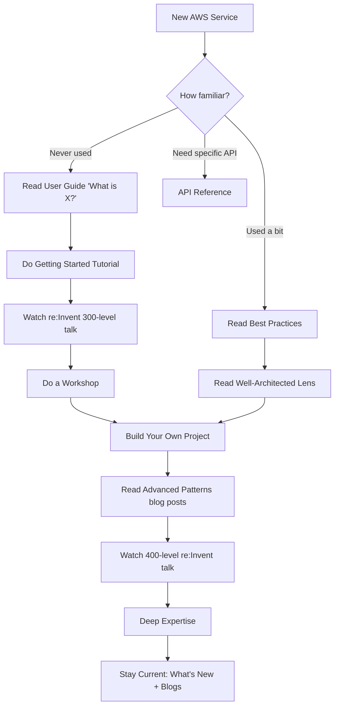

# Research: How to Effectively Learn AWS Services

## Summary

This document maps out the AWS learning ecosystem - what resources exist, when to use each one, and how they fit together into a practical learning workflow. The goal is to move beyond copy-paste usage of AWS docs and build real understanding of services like DynamoDB and Spring Boot + AWS integration.

The learning workflow follows a progression:
1. **Concepts first** - User guides, whitepapers, Well-Architected Framework
2. **Hands-on practice** - Workshops, Skill Builder labs, personal projects
3. **Deep expertise** - API references, advanced re:Invent talks, community resources
4. **Stay current** - What's New feed, AWS blogs, re:Invent sessions

---

## 1. AWS Documentation Structure

AWS documentation is organized into distinct document types, each serving a different purpose. Understanding which one to reach for saves a lot of time.

### Document Types

| Type | What It Is | When to Use It |
|------|-----------|----------------|
| **User Guide** | Conceptual explanations + console walkthroughs | Learning a service for the first time, understanding how features work |
| **Developer Guide** | Code-focused guide with SDK examples | Building applications that integrate with the service |
| **API Reference** | Every API operation, parameters, response shapes | Looking up exact method signatures, error codes, request/response formats |
| **Best Practices** | Opinionated guidance from AWS engineers | After you understand the basics - optimizing your design |
| **Whitepapers** | Deep-dive technical papers (10-80 pages) | Architecture decisions, understanding AWS philosophy |
| **Prescriptive Guidance** | Step-by-step patterns for common scenarios | Implementing specific architectures (migration, modernization, security) |

### URL Patterns

AWS docs follow predictable URL structures:
- User/Developer Guide: `docs.aws.amazon.com/{service}/latest/developerguide/`
- API Reference: `docs.aws.amazon.com/{service}/latest/APIReference/`
- Whitepapers: `docs.aws.amazon.com/whitepapers/latest/`
- Prescriptive Guidance: `docs.aws.amazon.com/prescriptive-guidance/latest/`

### Key Resources

- **AWS Architecture Center**: https://aws.amazon.com/architecture/ - Reference architectures, diagrams, best practices organized by workload type
- **Amazon Builders' Library**: https://aws.amazon.com/builders-library/ - Articles written by Amazon senior engineers about how Amazon builds and operates software. These are gold - they explain the thinking behind patterns, not just the patterns themselves.
- **AWS Solutions Library**: https://aws.amazon.com/solutions/ - Vetted, production-ready solutions with CloudFormation/CDK templates
- **AWS Prescriptive Guidance**: https://docs.aws.amazon.com/prescriptive-guidance/ - Detailed implementation strategies for common cloud tasks

### How to Read AWS Docs Effectively

Most people skim AWS docs looking for code snippets to copy. That's the wrong approach. Here's a better method:

1. **Read the "How it works" section first** - Every service has one. It explains the mental model. Skip this and you'll misuse the service.
2. **Understand the data model** - What are the core entities? How do they relate? (e.g., DynamoDB: tables, items, attributes, keys, indexes)
3. **Read the "Getting Started" tutorial end-to-end** - Don't skip steps. The tutorial is designed to build understanding incrementally.
4. **Study the "Best Practices" section** - This is where AWS engineers tell you what they've seen go wrong. Read it before you design anything.
5. **Use the API Reference as a lookup tool** - Don't read it cover-to-cover. Come here when you need exact parameter names, limits, or error codes.
6. **Check the "Quotas" page** - Every service has hard and soft limits. Know them before you hit them in production.

### Anti-patterns

- Jumping straight to Stack Overflow instead of reading the actual docs
- Copy-pasting code examples without reading the surrounding explanation
- Ignoring the "Important" and "Note" callout boxes (they contain critical gotchas)
- Not checking the doc version - AWS docs are versioned and sometimes you're reading outdated content

---

## 2. AWS Well-Architected Framework as a Learning Tool

The Well-Architected Framework isn't just a compliance checklist - it's one of the best structured learning resources AWS offers. It teaches you how to think about cloud architecture across six dimensions.

### The Six Pillars

| Pillar | Core Question | What You Learn |
|--------|--------------|----------------|
| **Operational Excellence** | How do you run and monitor systems? | Automation, IaC, observability, incident response |
| **Security** | How do you protect data and systems? | IAM, encryption, network security, incident response |
| **Reliability** | How do you recover from failures? | Fault tolerance, disaster recovery, scaling |
| **Performance Efficiency** | How do you use resources efficiently? | Right-sizing, caching, async patterns |
| **Cost Optimization** | How do you avoid wasting money? | Reserved capacity, right-sizing, lifecycle policies |
| **Sustainability** | How do you minimize environmental impact? | Region selection, efficient architectures, demand alignment |

### How to Use It for Learning

1. **Read the framework whitepaper** (https://docs.aws.amazon.com/wellarchitected/latest/framework/welcome.html) - It's ~100 pages but covers the mental models behind good cloud architecture.
2. **Use the Well-Architected Tool** - Free service in the AWS Console that walks you through review questions for your workloads. Even doing a review of a toy project teaches you what to think about.
3. **Study the Lenses** - AWS publishes domain-specific lenses (Serverless, SaaS, Machine Learning, Healthcare, etc.) that apply the framework to specific workload types.
4. **Do the Well-Architected Labs** (https://www.wellarchitectedlabs.com/) - Hands-on labs organized by pillar. These are free and run in your own AWS account.

### When to Use It

- Before designing a new system - use the pillars as a design checklist
- During architecture reviews - the questions surface blind spots
- When studying for AWS certifications - the framework is heavily tested
- When you want to understand "why" behind AWS recommendations, not just "what"

### Key Whitepapers Worth Reading

- **AWS Well-Architected Framework** - The main document, covers all six pillars
- **Reliability Pillar** - Deep dive into fault tolerance and disaster recovery patterns
- **Security Pillar** - Comprehensive security architecture guidance
- **Serverless Applications Lens** - If you're building with Lambda, DynamoDB, API Gateway
- **Amazon Builders' Library articles** - Not technically whitepapers, but written by Amazon engineers about how they build systems at scale. Topics include: leader election, caching, retry strategies, deployment safety.

---

## 3. AWS Skill Builder and Training Paths

### What It Is

AWS Skill Builder (https://aws.amazon.com/training/digital/) is AWS's official digital learning platform. It offers 1,000+ free courses, plus paid subscription content.

### Free vs. Paid

| Tier | What You Get |
|------|-------------|
| **Free** | 600+ digital courses, exam prep courses, learning plans, some Builder Labs |
| **Individual Subscription ($29/mo)** | AWS Cloud Quest (game-based learning), all Builder Labs, AWS Jam challenges, official practice exams, Lab Tutorials |

### Key Features

- **Learning Plans** - Curated course sequences organized by role (Solutions Architect, Developer, DevOps) and certification level. Good starting point if you don't know where to begin.
- **AWS Builder Labs** - Guided, hands-on exercises in a real AWS Console environment. Step-by-step instructions with pre-provisioned resources. No risk to your own account.
- **AWS Cloud Quest** - Game-based learning where you solve challenges by building AWS solutions. Surprisingly effective for kinesthetic learners.
- **Exam Prep Courses** - Official courses aligned to each AWS certification. Include practice questions and explanations.
- **Lab Tutorials (beta)** - Build real solutions in your own AWS account with expert guidance. More realistic than Builder Labs.

### When to Use It

- Starting from zero with a new AWS service - take the relevant learning plan
- Preparing for AWS certification - use exam prep courses + practice exams
- Want hands-on practice without risking your own account - Builder Labs
- Prefer structured learning over reading docs - video courses

### Recommended Learning Plans

- **AWS Cloud Practitioner Essentials** - If you're new to AWS entirely
- **Architecting on AWS** - Core architecture patterns
- **Developing on AWS** - SDK, Lambda, DynamoDB, API Gateway
- **DevOps Engineering on AWS** - CI/CD, IaC, monitoring

---

## 4. AWS Workshops (workshops.aws) and Hands-on Labs

### What It Is

AWS Workshops (https://workshops.aws) is a catalog of free, self-guided, hands-on tutorials created by AWS service teams. Each workshop walks you through building something real with step-by-step instructions.

### How It Differs from Skill Builder

| Feature | Skill Builder | Workshops.aws |
|---------|--------------|---------------|
| Environment | Managed sandbox (Builder Labs) | Your own AWS account (Free Tier eligible) |
| Structure | Video courses + guided labs | Step-by-step written tutorials |
| Depth | Broad coverage, introductory-intermediate | Often deeper, service-specific |
| Cost | Free tier + $29/mo subscription | Free (you pay for AWS resources used) |
| Cleanup | Automatic | You must clean up resources yourself |

### Notable Workshops

- **Wild Rydes Serverless** (https://aws.amazon.com/serverless-workshops/) - The classic. Builds a serverless web app with Lambda, API Gateway, DynamoDB, Cognito. Great first workshop.
- **DynamoDB Immersion Day** - Deep dive into DynamoDB data modeling, GSIs, streams
- **ECS Workshop** - Container orchestration with Fargate
- **CDK Workshop** (https://cdkworkshop.com/) - Build infrastructure with CDK in TypeScript/Python
- **Serverless Patterns** (https://serverlessland.com/) - Collection of minimal, deployable patterns for serverless architectures

### When to Use Workshops

- After reading the docs but before building your own project - workshops bridge the gap
- When you want to understand how services work together (most workshops use 3-5 services)
- When preparing for a new project that uses unfamiliar services
- Weekend learning sessions - most workshops take 2-4 hours

### Tips

- Always do the cleanup steps at the end to avoid surprise charges
- Use the AWS Free Tier account for workshops when possible
- Take notes on what surprised you - these become your personal gotchas list
- Modify the workshop after completing it - change the data model, add a feature, break it and fix it

---

## 5. AWS Blog Posts and What's New Announcements

### AWS Blogs

AWS maintains dozens of topic-specific blogs. The most useful ones for backend developers:

| Blog | URL | What It Covers |
|------|-----|---------------|
| **AWS News Blog** | https://aws.amazon.com/blogs/aws/ | Major launches, weekly roundups, feature deep dives |
| **AWS Architecture Blog** | https://aws.amazon.com/blogs/architecture/ | Reference architectures, design patterns, real-world case studies |
| **AWS Database Blog** | https://aws.amazon.com/blogs/database/ | DynamoDB, RDS, Aurora, ElastiCache patterns and best practices |
| **AWS Compute Blog** | https://aws.amazon.com/blogs/compute/ | Lambda, ECS, Fargate, Step Functions |
| **AWS DevOps Blog** | https://aws.amazon.com/blogs/devops/ | CI/CD, IaC, deployment strategies |
| **AWS Security Blog** | https://aws.amazon.com/blogs/security/ | IAM, encryption, compliance, incident response |
| **AWS Open Source Blog** | https://aws.amazon.com/blogs/opensource/ | Spring Boot on AWS, CDK, open source integrations |
| **AWS Startups Blog** | https://aws.amazon.com/blogs/startups/ | Practical architecture for small teams |

### What's New Feed

- URL: https://aws.amazon.com/new/
- RSS feed available for automation
- Every new feature, service, and region expansion gets announced here
- The weekly roundup posts on the AWS News Blog summarize the most important announcements

### How to Use Blogs for Learning

1. **Don't try to read everything** - Subscribe to 2-3 blogs relevant to your work (Database, Compute, Architecture)
2. **Read the "deep dive" posts** - These are 2,000-5,000 word posts that explain a feature with architecture diagrams and code. They're often better than the official docs for understanding "why" and "when."
3. **Study the architecture diagrams** - Blog posts often include architecture diagrams that show how services connect. These are great for building mental models.
4. **Check the "Related posts" section** - AWS blogs link to related content. Follow the chain to build a complete picture.
5. **Use the What's New feed to stay current** - Skim it weekly. When something relevant to your services appears, read the linked blog post.

### re:Invent Sessions

AWS re:Invent talks are published on YouTube and are some of the best learning content available:
- **200-level talks** - Introduction to a service or feature
- **300-level talks** - Intermediate, assumes you've used the service
- **400-level talks** - Advanced, deep dives into internals and advanced patterns
- **Breakout sessions** - 60 minutes, single topic
- **Chalk talks** - Interactive, smaller audience, Q&A focused

Search YouTube for `AWS re:Invent {year} {service}` to find relevant talks. The 300 and 400 level talks are where the real learning happens.

---

## 6. How to Read and Learn from AWS Documentation Effectively

This is the most important section. Most developers use AWS docs as a copy-paste source. That builds fragile knowledge that breaks the moment you hit a non-trivial problem.

### The "Understand, Don't Copy" Method

```
Phase 1: ORIENT (30 min)
  - Read the service overview / "What is X?" page
  - Understand the core concepts and data model
  - Draw the mental model on paper (entities, relationships, flows)

Phase 2: WALK THROUGH (1-2 hours)
  - Do the "Getting Started" tutorial
  - At each step, ask: "Why this step? What would happen if I skipped it?"
  - Note every concept you don't fully understand

Phase 3: STUDY BEST PRACTICES (1 hour)
  - Read the Best Practices section
  - For each recommendation, understand the failure mode it prevents
  - Cross-reference with the Well-Architected Framework pillar it relates to

Phase 4: BUILD SOMETHING (2-4 hours)
  - Build a small project that uses the service
  - Don't follow a tutorial - design it yourself using what you learned
  - When you get stuck, go back to the docs (not Stack Overflow first)

Phase 5: BREAK IT (1-2 hours)
  - Intentionally trigger error conditions
  - Hit the service limits
  - Test failure scenarios (what happens when X goes down?)
  - This builds the debugging intuition you need for production
```

### Reading Strategies by Document Type

**For User/Developer Guides:**
- Read linearly the first time through a new service
- Focus on the "How it works" and "Concepts" sections
- Skip the console walkthrough if you prefer CLI/SDK - but read the explanations

**For API References:**
- Don't read cover-to-cover
- Use as a lookup tool when you know what operation you need
- Pay attention to: required vs optional parameters, error codes, pagination behavior, eventual consistency notes

**For Whitepapers:**
- Read the executive summary first
- Then read the section most relevant to your current problem
- Come back to other sections when they become relevant
- Take notes - whitepapers are dense and you won't remember everything

**For Blog Posts:**
- Read the architecture diagram first
- Then read the "why" sections
- Code examples in blogs are often more practical than doc examples
- Check the publication date - AWS services evolve fast

### Common Mistakes

1. **Reading docs without a goal** - Always have a specific question you're trying to answer
2. **Skipping the concepts section** - You'll misuse the service if you don't understand the mental model
3. **Not reading error documentation** - The error codes section tells you what can go wrong and why
4. **Ignoring service quotas** - Every service has limits. Know them before you design around the service.
5. **Not checking the changelog** - AWS docs have a "Document history" page that shows recent changes
6. **Treating docs as the only source** - Combine docs + blog posts + re:Invent talks + hands-on practice for complete understanding

---

## 7. DynamoDB-Specific Learning Resources

DynamoDB has one of the steepest learning curves of any AWS service because it requires you to unlearn relational database thinking. The resources below are ordered from foundational to advanced.

### The DynamoDB Developer Guide

- URL: https://docs.aws.amazon.com/amazondynamodb/latest/developerguide/Introduction.html
- This is the official AWS documentation and it's actually quite good for DynamoDB

**Key sections to read in order:**
1. **What is DynamoDB?** - Core concepts, characteristics, use cases
2. **Core Components** - Tables, items, attributes, primary keys, secondary indexes
3. **Read/Write Capacity Modes** - On-demand vs provisioned, when to use each
4. **Data Modeling** - This is the critical section. Covers:
   - Key schema design (partition key, sort key)
   - Secondary indexes (GSI, LSI)
   - Single-table vs multi-table design
   - Data modeling building blocks (composite sort key, sparse index, write sharding, vertical partitioning)
5. **Best Practices for Modeling Relational Data** - How to think about DynamoDB differently from SQL
6. **DynamoDB Streams** - Change data capture for event-driven architectures
7. **Transactions** - ACID transactions in DynamoDB
8. **DAX (DynamoDB Accelerator)** - In-memory caching layer

### Rick Houlihan's re:Invent Talks

Rick Houlihan is a former AWS Principal Technologist who essentially defined DynamoDB data modeling best practices. His talks are legendary in the DynamoDB community. He gets his own section in every DynamoDB resource list.

**Must-watch talks (in recommended order):**

| Year | Talk | Level | Focus |
|------|------|-------|-------|
| 2018 | [Advanced Design Patterns](https://t.co/ivlcYMhkur?amp=1) | 400 | The foundational talk. Introduces single-table design, adjacency lists, composite keys. Watch this first. |
| 2019 | [Advanced Design Patterns](https://t.co/fRtp2X3Vgg?amp=1) | 400 | Expanded version with more examples. Covers write sharding, sparse indexes, time-series data. |
| 2020 | Advanced Design Patterns [Part 1](https://youtu.be/MF9a1UNOAQo) & [Part 2](https://youtu.be/_KNrRdWD25M) | 400 | Split into two sessions. More real-world examples, gaming and social media data models. |
| 2021 | [Advanced Design Patterns](https://www.youtube.com/watch?v=xfxBhvGpoa0) | 400 | Latest iteration with updated patterns. |

**What makes these talks special:**
- Rick explains the "why" behind every pattern, not just the "how"
- He shows how Amazon.com itself uses DynamoDB at scale
- He demonstrates the thought process of converting a relational model to DynamoDB
- The talks build on each other - each year adds new patterns while reinforcing fundamentals

**How to watch them effectively:**
1. Watch the 2018 talk first - it's the foundation
2. Pause and diagram each pattern he shows
3. Try to implement the patterns yourself in a test table
4. Then watch the 2019-2021 talks for additional patterns and refinements

### The DynamoDB Book by Alex DeBrie

- URL: https://dynamodbbook.com/
- Author: Alex DeBrie (AWS Data Hero)
- Endorsed by Rick Houlihan himself

**What it covers:**
- Part 1: DynamoDB fundamentals (concepts, API, expressions)
- Part 2: Data modeling strategies (single-table design, relationships, filtering, sorting)
- Part 3: Real-world examples (4-5 complete data modeling walkthroughs)

**Why it's worth reading:**
- It's the most comprehensive single resource on DynamoDB data modeling
- The real-world examples in Part 3 are the best part - they walk through the complete thought process from access patterns to final schema
- Written in plain language, not academic style
- Covers things the official docs don't explain well (like when NOT to use single-table design)

**How it fits into the learning workflow:**
1. Read the AWS Developer Guide first (free, covers fundamentals)
2. Watch Rick Houlihan's 2018 talk (free, builds the mental model)
3. Read The DynamoDB Book (paid, deepens understanding with real examples)
4. Build something yourself (apply what you learned)

### Alex DeBrie's Other Resources

- **DynamoDB Guide** (https://www.dynamodbguide.com/) - Free online guide, good quick reference
- **awesome-dynamodb** (https://github.com/alexdebrie/awesome-dynamodb) - Curated list of DynamoDB resources, tools, and articles
- **re:Invent 2022: Deploy modern and effective data models with DynamoDB** (https://youtu.be/SC-YAPgJpms) - Talk with Alex DeBrie and DynamoDB Principal Engineer Amrith Kumar
- **re:Invent 2021: Data Modeling with DynamoDB** (https://www.youtube.com/watch?v=yNOVamgIXGQ) - More accessible than Rick's 400-level talks, good intermediate resource

### Tools for Learning DynamoDB

- **NoSQL Workbench for DynamoDB** (https://docs.aws.amazon.com/amazondynamodb/latest/developerguide/workbench.html) - Visual tool for designing and visualizing data models. Use it to prototype your schema before writing code.
- **DynamoDB Local** - Run DynamoDB on your laptop for free experimentation. No AWS account needed.
- **Dynobase** (https://dynobase.dev/) - GUI client for DynamoDB. Makes it easier to browse and query tables during development.
- **DynamoDB Toolbox** (https://github.com/jeremydaly/dynamodb-toolbox) - JavaScript library for single-table designs. Good for understanding the patterns in code.
- **ElectroDB** (https://github.com/tywalch/electrodb) - TypeScript library that makes single-table design more ergonomic.

### Recommended DynamoDB Learning Path

```
Week 1: Foundations
  - Read DynamoDB Developer Guide: "What is DynamoDB?" through "Core Components"
  - Do the DynamoDB Getting Started tutorial
  - Install NoSQL Workbench

Week 2: Data Modeling Fundamentals
  - Read Developer Guide: "Data Modeling" section
  - Watch Rick Houlihan 2018 re:Invent talk
  - Practice: Model a simple e-commerce app (users, orders, products)

Week 3: Advanced Patterns
  - Read Developer Guide: "Best Practices for Modeling Relational Data"
  - Watch Rick Houlihan 2019 re:Invent talk
  - Read The DynamoDB Book (Part 1 + Part 2)

Week 4: Real-World Application
  - Read The DynamoDB Book (Part 3 - real-world examples)
  - Build a project using DynamoDB with your preferred language/framework
  - Practice: Design the data model for your actual project (not-another-rewatch)
```

---

## 8. Spring Boot + AWS Integration Learning Resources

There are two main approaches to integrating Spring Boot with AWS services: using the AWS SDK for Java directly, or using Spring Cloud AWS which wraps the SDK with Spring-native abstractions.

### Approach 1: AWS SDK for Java 2.x (Direct)

- Developer Guide: https://docs.aws.amazon.com/sdk-for-java/latest/developer-guide/get-started.html
- GitHub: https://github.com/aws/aws-sdk-java-v2

**What it is:** The official AWS SDK for Java. Works with any Java framework including Spring Boot. You create SDK clients directly and call AWS APIs.

**When to use it:**
- When you need full control over AWS API calls
- When Spring Cloud AWS doesn't support the service you need
- When you want to minimize dependencies
- For DynamoDB specifically: the **Enhanced Client** (`DynamoDbEnhancedClient`) provides a higher-level, annotation-based mapping that works well with Spring Boot

**Key resources:**
- [Getting Started with AWS SDK for Java 2.x](https://docs.aws.amazon.com/sdk-for-java/latest/developer-guide/get-started.html)
- [Using AWS SDK for Java 2.x](https://docs.aws.amazon.com/sdk-for-java/latest/developer-guide/using.html) - Covers sync/async, pagination, waiters, error handling
- [Database examples with SDK for Java 2.x](https://docs.aws.amazon.com/sdk-for-java/latest/developer-guide/examples-databases.html) - DynamoDB, RDS, Redshift examples
- [DynamoDB Enhanced Client README](https://github.com/aws/aws-sdk-java-v2/blob/master/services-custom/dynamodb-enhanced/README.md) - The Enhanced Client is the recommended way to use DynamoDB from Java

### Approach 2: Spring Cloud AWS

- Docs: https://docs.awspring.io/spring-cloud-aws/docs/3.0.0-M1/reference/html/index.html
- GitHub: https://github.com/awspring/spring-cloud-aws

**What it is:** An open-source project that wraps AWS SDK calls with Spring-native abstractions. Auto-configures credentials, region, and SDK clients. Provides Spring Boot starters for common services.

**Supported services (as of 3.x):**
- S3 (via `spring-cloud-aws-starter-s3`) - S3 objects as Spring Resources, S3Template
- SES (via `spring-cloud-aws-starter-ses`) - Spring MailSender backed by SES
- SNS (via `spring-cloud-aws-starter-sns`) - Notification sending + HTTP endpoint
- Secrets Manager (via `spring-cloud-aws-starter-secrets-manager`) - External configuration
- Parameter Store (via `spring-cloud-aws-starter-parameter-store`) - External configuration
- DynamoDB (via `spring-cloud-aws-starter-dynamodb`) - DynamoDbTemplate, repository support

**When to use it:**
- When you want Spring-idiomatic AWS integration (auto-configuration, Spring Boot starters)
- When you're using S3, SES, SNS, Secrets Manager, or Parameter Store
- When you want automatic credential and region resolution that follows Spring Boot conventions

**Key blog posts:**
- [Getting started with Spring Boot on AWS: Part 1](https://aws.amazon.com/blogs/opensource/getting-started-with-spring-boot-on-aws-part-1/) - Official AWS blog post on Spring Boot + AWS
- [Integrate Spring Boot with Amazon ElastiCache](https://aws.amazon.com/blogs/database/integrate-your-spring-boot-application-with-amazon-elasticache/) - Caching with Spring Boot
- [Use Spring Cloud to capture DynamoDB changes through Kinesis](https://aws.amazon.com/blogs/database/use-spring-cloud-to-capture-amazon-dynamodb-changes-through-amazon-kinesis-data-streams/) - Event-driven patterns

### Spring Boot + DynamoDB Specifically

The most common patterns for using DynamoDB with Spring Boot:

**Option A: AWS SDK Enhanced Client (recommended for most cases)**
```
Dependencies: software.amazon.awssdk:dynamodb-enhanced
Approach: Annotate Java classes with @DynamoDbBean, @DynamoDbPartitionKey, etc.
Pros: Full control, well-documented, official AWS support
Cons: More boilerplate than Spring Data
```

**Option B: Spring Cloud AWS DynamoDB**
```
Dependencies: io.awspring.cloud:spring-cloud-aws-starter-dynamodb
Approach: DynamoDbTemplate + repository pattern
Pros: Spring-native, less boilerplate
Cons: Newer, less documentation, may not support all DynamoDB features
```

**Option C: Spring Data DynamoDB (community)**
```
Dependencies: io.github.boostchicken:spring-data-dynamodb
Approach: Spring Data repository interface
Pros: Familiar Spring Data patterns
Cons: Community-maintained, may lag behind SDK updates
```

### Spring Boot on AWS Lambda

For deploying Spring Boot apps as Lambda functions:

- **Spring Cloud Function** - Adapter that lets you deploy Spring Boot functions to Lambda
- **AWS Lambda SnapStart** - Dramatically reduces cold start times for Java Lambda functions. Critical for Spring Boot on Lambda.
- **AWS Serverless Spring Boot Demo** - https://docs.aws.amazon.com/lambda/latest/dg/lambda-samples.html (listed under Java samples)
- **GraalVM Native Image** - Compile Spring Boot to native binary for near-instant cold starts on Lambda

### Recommended Spring Boot + AWS Learning Path

```
Week 1: AWS SDK for Java 2.x Basics
  - Read the SDK Developer Guide "Getting Started" section
  - Set up a Spring Boot project with AWS SDK dependencies
  - Build a simple app that reads/writes to S3

Week 2: DynamoDB with Spring Boot
  - Learn the DynamoDB Enhanced Client
  - Build a CRUD API with Spring Boot + DynamoDB Enhanced Client
  - Practice: Model your project's data with @DynamoDbBean annotations

Week 3: Spring Cloud AWS
  - Read the Spring Cloud AWS 3.x docs
  - Refactor your app to use Spring Cloud AWS starters
  - Add Secrets Manager or Parameter Store for configuration

Week 4: Production Patterns
  - Add error handling, retries, and circuit breakers
  - Deploy to Lambda with Spring Cloud Function + SnapStart
  - Or deploy to ECS Fargate with CDK
```

---

## 9. Putting It All Together: Learning Workflow



### The Learning Stack (bottom to top)

```
Level 5: STAY CURRENT
  - What's New feed, AWS blogs, re:Invent sessions
  - When: Ongoing, weekly skim

Level 4: DEEP EXPERTISE  
  - 400-level re:Invent talks, Builders' Library, advanced blog posts
  - When: After you've built something real with the service

Level 3: BUILD
  - Personal projects, workshops, Builder Labs
  - When: After understanding concepts, before production use

Level 2: UNDERSTAND
  - Developer guides, best practices, 300-level talks, books
  - When: After orientation, before building

Level 1: ORIENT
  - User guide overview, "What is X?", Getting Started tutorial
  - When: First encounter with a service
```

---

## Sources

- [AWS DynamoDB Developer Guide](https://docs.aws.amazon.com/amazondynamodb/latest/developerguide/Introduction.html) - accessed 2026-04-14
- [AWS Well-Architected Framework](https://docs.aws.amazon.com/wellarchitected/latest/framework/welcome.html) - accessed 2026-04-14
- [First steps for modeling relational data in DynamoDB](https://docs.aws.amazon.com/amazondynamodb/latest/developerguide/bp-modeling-nosql.html) - accessed 2026-04-14
- [Best practices for modeling relational data in DynamoDB](https://docs.aws.amazon.com/amazondynamodb/latest/developerguide/bp-relational-modeling.html) - accessed 2026-04-14
- [DynamoDB data modeling building blocks](https://docs.aws.amazon.com/amazondynamodb/latest/developerguide/data-modeling-blocks.html) - accessed 2026-04-14
- [DynamoDB Best Practices - AWS Prescriptive Guidance](https://docs.aws.amazon.com/prescriptive-guidance/latest/dynamodb-data-modeling/best-practices.html) - accessed 2026-04-14
- [AWS SDK for Java 2.x - Getting Started](https://docs.aws.amazon.com/sdk-for-java/latest/developer-guide/get-started.html) - accessed 2026-04-14
- [AWS SDK for Java 2.x - Database examples](https://docs.aws.amazon.com/sdk-for-java/latest/developer-guide/examples-databases.html) - accessed 2026-04-14
- [AWS Documentation Update 2025](https://aws.amazon.com/blogs/aws-insights/aws-documentation-update-progress-challenges-and-whats-next-for-2025/) - accessed 2026-04-14
- ⚠️ External link - [The DynamoDB Book](https://dynamodbbook.com/) - accessed 2026-04-14
- ⚠️ External link - [awesome-dynamodb GitHub](https://github.com/alexdebrie/awesome-dynamodb) - accessed 2026-04-14
- ⚠️ External link - [Spring Cloud AWS 3.x Docs](https://docs.awspring.io/spring-cloud-aws/docs/3.0.0-M1/reference/html/index.html) - accessed 2026-04-14
- ⚠️ External link - [The DynamoDB Book Interview - High Scalability](https://highscalability.com/the-dynamodb-book-an-interview-with-alex-debrie-on-his-new-b/) - accessed 2026-04-14
- [Getting started with Spring Boot on AWS](https://aws.amazon.com/blogs/opensource/getting-started-with-spring-boot-on-aws-part-1/) - accessed 2026-04-14
- [Integrate Spring Boot with Amazon ElastiCache](https://aws.amazon.com/blogs/database/integrate-your-spring-boot-application-with-amazon-elasticache/) - accessed 2026-04-14
- [Use Spring Cloud to capture DynamoDB changes](https://aws.amazon.com/blogs/database/use-spring-cloud-to-capture-amazon-dynamodb-changes-through-amazon-kinesis-data-streams/) - accessed 2026-04-14
- [AWS Skill Builder](https://aws.amazon.com/training/digital/) - accessed 2026-04-14
- [AWS Workshops](https://workshops.aws) - accessed 2026-04-14
- [AWS Serverless Workshops](https://aws.amazon.com/serverless-workshops/) - accessed 2026-04-14
- [AWS Builder Labs announcement](https://aws.amazon.com/blogs/training-and-certification/grow-your-cloud-skills-with-19-new-hands-on-aws-builder-labs/) - accessed 2026-04-14
- [AWS Well-Architected Labs](https://www.wellarchitectedlabs.com/) - accessed 2026-04-14
- [Lambda sample applications](https://docs.aws.amazon.com/lambda/latest/dg/lambda-samples.html) - accessed 2026-04-14
