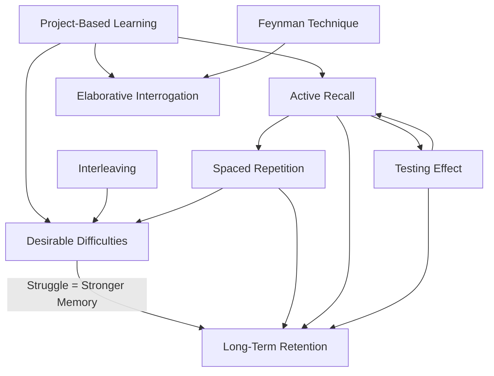

# Evidence-Based Learning Methods for Software Engineers

> Research compiled 2026-04-14. Each method includes: what it is, evidence it works, and how to apply it to learning tech stacks (DynamoDB, Spring Boot, React, Docker, AWS).

## Executive Summary

Eight learning methods backed by cognitive science research, ranked by evidence strength:

| Method | Evidence Strength | Key Finding | Best For |
|--------|------------------|-------------|----------|
| Spaced Repetition | Very Strong | 2x+ retention vs cramming | API syntax, CLI commands, config patterns |
| Active Recall | Very Strong | 50-80% more retention vs re-reading | Any technical concept |
| Testing Effect | Very Strong | 80% vs 36% retention at 1 week | Exam prep, certification study |
| Desirable Difficulties | Strong | Struggle during learning = stronger long-term memory | Debugging, system design |
| Interleaving | Strong | Better transfer to new problems | Multi-service architectures |
| Elaborative Interrogation | Moderate-Strong | Asking "why" produces robust factual + inference learning | Understanding AWS service design decisions |
| Feynman Technique | Moderate | 10-20% higher scores from teaching others | Complex concepts (DynamoDB partitioning, React reconciliation) |
| Project-Based Learning | Moderate | Improved critical thinking + problem solving | End-to-end skill integration |

The single most impactful change: **stop re-reading docs and start testing yourself on them.**

---

## 1. Spaced Repetition

### What It Is

Reviewing material at increasing intervals over time instead of cramming it all at once. First documented by Hermann Ebbinghaus in the 1880s. Modern implementations use algorithms (like Anki's FSRS) that adapt intervals based on how well you remember each item.

The core idea: when you're about to forget something, that's the optimal moment to review it. Each successful retrieval at that point strengthens the memory more than reviewing when it's still fresh.

### Evidence

- **Ebbinghaus (1885)**: Discovered the "forgetting curve" - without review, ~70% of new information is lost within 24 hours
- **Cepeda et al. (2006)**: Meta-analysis of 254 studies confirmed spacing produces better retention than massing, often by a factor of 2x or more, even with equal total study time
- **Bjork & Bjork (2011)**: Explained the mechanism - when retrieval strength is low (you've partially forgotten), successful recall produces large gains in storage strength
- **FSRS community (2025)**: Users of the Free Spaced Repetition Scheduler reported 30% increase in long-term retention of technical vocabulary vs older algorithms, with 20-30% fewer reviews needed

### How It Works (The Mechanism)

Every memory has two properties (Bjork & Bjork, 1992):
- **Storage strength**: How deeply encoded the memory is. Once high, it never decreases.
- **Retrieval strength**: How easily you can access it right now. Drops rapidly without use.

The key insight: practicing when retrieval strength is HIGH barely increases storage strength. Practicing when retrieval strength is LOW (you've partially forgotten) produces massive storage gains. This is why spacing works - the forgetting between sessions is the feature, not the bug.

### Applying to Tech Stacks

**DynamoDB**:
- Flashcards for: partition key vs sort key, GSI vs LSI tradeoffs, capacity modes, consistency models
- Schedule: Day 1 learn → Day 3 review → Day 7 → Day 14 → Day 30
- Card example: "What happens when a DynamoDB partition exceeds 10GB?" → "The partition splits. Data is redistributed. GSIs may throttle if they share the hot partition."

**Spring Boot**:
- Flashcards for: annotation meanings (@Autowired, @Transactional, @ConditionalOnProperty), config precedence, actuator endpoints
- Cloze deletions: `@SpringBootApplication` combines `{{c1::@Configuration}}`, `{{c2::@EnableAutoConfiguration}}`, and `{{c3::@ComponentScan}}`

**React**:
- Flashcards for: hook rules, useEffect cleanup patterns, reconciliation algorithm, key prop behavior
- Card: "When does useEffect cleanup run?" → "Before every re-execution of the effect, and on unmount"

**Docker**:
- Flashcards for: Dockerfile instructions (COPY vs ADD), layer caching rules, networking modes, volume types
- Card: "What's the difference between CMD and ENTRYPOINT?" → "ENTRYPOINT sets the executable, CMD provides default arguments. CMD is overridden by docker run args, ENTRYPOINT is not (unless --entrypoint)."

**AWS (general)**:
- Flashcards for: IAM policy evaluation logic, VPC CIDR rules, S3 consistency model, Lambda cold start factors
- 15-30 minutes daily review is the recommended cadence for developers

### Tools

- **Anki** (free, open source) - gold standard for spaced repetition. Use FSRS algorithm (built-in since 2024).
- **AnkiConnect plugin** - programmatically generate cards from code/docs
- Create cards from your own mistakes and debugging sessions - these stick better than pre-made decks

---

## 2. Active Recall vs Passive Reading

### What It Is

Active recall = retrieving information from memory without looking at the source. You close the docs, and try to produce the answer from memory.

Passive reading = re-reading notes, highlighting, copying, watching tutorials. You're exposed to information but never forced to retrieve it.

The defining difference: active recall requires **production** (generating the answer). Passive reading only requires **recognition** (seeing something familiar).

### Evidence

- **Roediger & Karpicke (2006)**: Landmark study. Students who read a passage once then took 3 recall tests remembered **61%** after one week. Students who re-read it 4 times remembered only **40%**. Less exposure time, dramatically better retention.
- **Roediger & Karpicke (2006, second study)**: Testing group retained **80%** at one week vs **36%** for restudying group - more than double.
- **Kornell & Bjork (2008)**: Students using passive methods consistently **overestimated** their future test performance. Active recall users had more accurate self-assessment - they knew what they actually knew.
- **Dunlosky et al. (2013)**: Large meta-review rated re-reading and highlighting as **low utility** strategies. Practice testing and distributed practice rated **high utility**.
- **Neuroimaging studies**: Active retrieval shows increased hippocampal and prefrontal cortex activation. The strength of this activation predicts later recall success.

### Why Re-Reading Docs Doesn't Work

Re-reading creates the **"illusion of fluency"**. When you re-read the DynamoDB docs, the concepts look familiar. Your brain interprets this familiarity as understanding. But familiarity ≠ recall ability.

This is why developers can read the same AWS docs multiple times and still blank when they need to configure something from memory. Recognition and recall are different cognitive processes. Re-reading trains recognition. Active recall trains production.

Even **failed** retrieval attempts are beneficial. When you try to recall something and can't, the subsequent feedback (checking the answer) produces stronger encoding than if you'd just re-read the answer without trying first.

### Applying to Tech Stacks

**DynamoDB**:
- After reading about single-table design, close the docs. Write down from memory: what are the access patterns you'd model? What's the PK/SK structure? Then check.
- Before looking up a query syntax, try to write it from memory first.

**Spring Boot**:
- After reading about dependency injection, close the IDE. On paper, draw the bean lifecycle from memory. Where does @PostConstruct fire? What about @PreDestroy?
- Brain dump: write everything you know about Spring Security filter chain without notes. Then compare.

**React**:
- After a tutorial on hooks, close it. Write a custom hook from memory that fetches data with loading/error states. Then compare to the tutorial.
- Blank page exercise: "Write everything you know about React's rendering behavior" - no notes, 5 minutes.

**Docker**:
- After reading about multi-stage builds, close the docs. Write a Dockerfile from memory for a Java app. Then check what you missed.
- Quiz yourself: "What are the 7 Dockerfile instructions I used in my last project?" before checking.

**AWS**:
- After studying IAM policies, close everything. Write a policy from memory that grants S3 read access to a specific bucket. Then validate.
- Before every `aws cli` command, try to type it from memory before checking docs.

### The Switch

Replace this workflow:
1. Read docs → Read docs again → Hope you remember

With this:
1. Read docs once → Close docs → Write down what you remember → Check gaps → Make flashcards for gaps → Review with spaced repetition

---

## 3. Feynman Technique

### What It Is

Named after physicist Richard Feynman. Four steps:
1. **Choose a concept** you want to understand
2. **Explain it in simple language** as if teaching someone with no background
3. **Identify gaps** - where you struggle to explain clearly, you've found a gap in understanding
4. **Go back to the source** for those specific gaps, then explain again

The test: if you can't explain it simply, you don't understand it well enough.

### Evidence

- **Koh et al. (2018)**: Students who taught material to others scored **10-20% higher** on subsequent tests than those who only studied for themselves (the "protege effect")
- **Fiorella & Mayer (2013)**: Meta-analysis found that generating explanations produces better learning than receiving explanations
- **Nestojko et al. (2014)**: Even just *expecting* to teach material (without actually teaching) improved learning, because it changed how people encoded the information
- **ResearchGate (2022)**: Study on the Feynman Technique as a heutagogy-based learning strategy found it effective for independent and remote learning in e-learning contexts

### Why It Works

Explaining forces you to:
- Organize information into a coherent narrative (not just isolated facts)
- Identify which parts you actually understand vs which parts you're hand-waving
- Create connections between concepts (which strengthens memory networks)
- Translate jargon into meaning (if you can only repeat the jargon, you don't understand it)

### Applying to Tech Stacks

**DynamoDB**:
- Explain to a non-technical person: "Why can't you just use a regular database? What problem does DynamoDB solve?"
- Explain partition keys: "Imagine a library where books are sorted into rooms. The partition key decides which room. If all books go to one room, that room gets crowded and slow."
- If you can't explain why you'd choose a GSI over a LSI without jargon, go back to the docs.

**Spring Boot**:
- Explain dependency injection to a junior: "Instead of each class creating its own dependencies, Spring creates them and hands them over. Like a restaurant where the kitchen sends food to your table instead of you going to the kitchen."
- Explain auto-configuration: "Spring Boot looks at what libraries are on your classpath and guesses what you probably want configured. It's like a smart home that turns on lights when you walk in."

**React**:
- Explain the virtual DOM: "React keeps a lightweight copy of the page in memory. When something changes, it compares the old copy to the new one and only updates the parts that actually changed."
- Explain useState: "It's a way to give a component a memory. Without it, every time the component re-renders, it forgets everything."

**Docker**:
- Explain containers vs VMs: "A VM is like renting an entire apartment. A container is like renting a desk in a co-working space. You get your own workspace but share the building's infrastructure."
- Explain layers: "Each instruction in a Dockerfile creates a snapshot. Docker stacks these snapshots. If you change one instruction, only that snapshot and everything after it gets rebuilt."

**AWS**:
- Explain IAM to a new team member without using the words "principal", "resource", or "policy document"
- Explain VPCs: "It's your own private network inside AWS. Like having your own floor in an office building with your own security desk."

### Practice Format

Keep a "Feynman journal" - pick one concept per day and write a 3-5 sentence explanation in plain English. If you get stuck, that's your study target for the day.

---

## 4. Elaborative Interrogation

### What It Is

A questioning technique where you ask "why?" and "how?" about every new fact or concept you encounter. Instead of passively accepting information, you force yourself to generate explanations for why it's true or how it works.

Example: Instead of reading "DynamoDB uses consistent hashing for partition placement" and moving on, you ask: "Why consistent hashing? What problem does it solve? What would happen without it? How does it handle node failures?"

### Evidence

- **Dunlosky et al. (2013)**: Rated elaborative interrogation as a **moderate utility** strategy in their comprehensive review of 10 learning techniques. It produced "robust gains in both factual and inference learning."
- **Pressley et al. (1992)**: Found elaborative interrogation was effective even for students with mild learning disabilities
- **Frontiers in Psychology (2019)**: Confirmed benefits but noted learners need some prior knowledge for the technique to work - you need enough context to generate meaningful "why" questions
- **Virtonomics study**: Self-paced learning with elaborative interrogation took only 32 minutes (reading + interrogation) vs 28 minutes for reading-only, but produced significantly better retention. Minimal time cost for substantial learning gain.

### Why It Works

- Forces **deeper processing** - you can't just skim, you have to engage with the material
- Creates **connections** to existing knowledge (answering "why" requires linking new info to what you already know)
- Exposes **shallow understanding** - if you can't answer "why", you've found a gap
- Produces **self-generated elaborations** which are remembered better than provided explanations (generation effect)

### Applying to Tech Stacks

**DynamoDB**:
- "Why is there a 400KB item size limit?" → Because items are stored in B-tree leaf nodes within partitions, and large items would reduce partition efficiency and increase I/O costs
- "Why does a Scan consume more RCU than a Query?" → Because Scan reads every item in the table sequentially, while Query uses the partition key to go directly to the right partition
- "How does DynamoDB achieve single-digit millisecond latency?" → Consistent hashing for partition routing + SSD storage + request router caching of partition metadata

**Spring Boot**:
- "Why does Spring use proxies for @Transactional?" → Because the transaction logic needs to wrap the method call. A proxy intercepts the call, starts the transaction, delegates to the real method, then commits or rolls back.
- "Why can't @Transactional work on private methods?" → Because Spring uses JDK dynamic proxies or CGLIB proxies, and proxies can only intercept public method calls from outside the class.

**React**:
- "Why does React need a key prop in lists?" → To identify which items changed, were added, or removed during reconciliation. Without keys, React re-renders the entire list.
- "Why are hooks order-dependent?" → Because React stores hook state in an array indexed by call order. If the order changes between renders, hooks get the wrong state.

**Docker**:
- "Why does changing an early Dockerfile layer invalidate all subsequent layers?" → Because Docker's layer caching uses a hash chain. Each layer's cache key depends on the previous layer's hash + the current instruction.
- "Why use multi-stage builds?" → To separate build dependencies from runtime dependencies, reducing final image size and attack surface.

**AWS**:
- "Why does S3 have eventual consistency for deletes but strong consistency for reads?" → (As of Dec 2020, S3 provides strong read-after-write consistency for all operations. Ask: "Why did it take until 2020 to achieve this?")
- "Why are IAM policies deny-by-default?" → Principle of least privilege. Explicit deny always wins over allow to prevent privilege escalation through policy combinations.

### Practice Habit

When reading any technical documentation, pause after each major concept and write one "why" and one "how" question. Answer them before moving on. If you can't answer, that's your study target.

---

## 5. Interleaving

### What It Is

Mixing different topics or problem types during a study session instead of studying one topic at a time (blocking).

- **Blocking**: Study DynamoDB for 2 hours → Study React for 2 hours → Study Docker for 2 hours
- **Interleaving**: 30 min DynamoDB → 30 min React → 30 min Docker → 30 min DynamoDB → 30 min React → 30 min Docker

Interleaving feels harder and less productive. That's the point.

### Evidence

- **Kornell & Bjork (2008)**: Students who interleaved study of art styles were better at categorizing new paintings they'd never seen. But they *believed* blocking was more effective - their subjective experience was wrong.
- **Rohrer (2012)**: Interleaving beats blocking for learning because it forces "discrimination learning" - you have to identify which approach applies, not just execute a known procedure.
- **Frontiers in Psychology (2023)**: Interleaved instruction showed better memory when tested 2 weeks later, while blocked instruction only showed better memory on same-day tests.
- **Springer (2021)**: Systematic review confirmed interleaving is more effective for long-term learning, attributed to both spacing effects and discriminative-contrast (comparing different concepts forces deeper processing).

### Why It Works

Two mechanisms:
1. **Spacing effect**: Switching topics creates natural spacing between exposures to each topic
2. **Discrimination learning**: When you see DynamoDB, then React, then Docker problems mixed together, you have to first identify *what kind of problem this is* before solving it. Blocking skips this step because you already know the category.

In real work, problems don't come pre-labeled. Interleaving trains the skill of recognizing which tool/pattern applies.

### Applying to Tech Stacks

**Mixed study sessions**:
Instead of "DynamoDB week" followed by "React week", interleave:
- Monday: DynamoDB single-table design → React state management → Docker networking
- Tuesday: AWS IAM policies → Spring Boot security → DynamoDB streams
- Wednesday: React hooks → Docker compose → AWS Lambda

**Mixed practice problems**:
Create a problem set that mixes:
- "Design a DynamoDB table for this access pattern"
- "Write a React component that does X"
- "Write a Dockerfile for this application"
- "Configure an IAM policy for this scenario"

The key: you don't know which type of problem is coming next.

**Cross-service architecture thinking**:
- "How would you connect a React frontend to a Spring Boot API backed by DynamoDB, deployed in Docker on ECS?"
- This naturally interleaves all five technologies and forces you to think about how they connect.

**When to use blocking instead**:
- When you're a complete beginner in a topic and need to build basic schema first
- Interleaving works best when you have at least foundational knowledge in each topic
- Rule of thumb: block for the first 2-3 hours of a brand new topic, then switch to interleaving

---

## 6. Project-Based Learning

### What It Is

Learning by building real things that solve real (or realistic) problems. Instead of studying each technology in isolation, you learn them in the context of a working system.

The project provides the "why" for every concept. You don't learn DynamoDB table design in the abstract - you learn it because your app needs to store and retrieve user data efficiently.

### Evidence

- **Frontiers in Education (2025)**: "Project-based learning is widely recognized as an effective pedagogical approach in software engineering education, fostering real-world problem-solving, collaboration, and the integration of theory and practice."
- **ResearchGate (2019)**: Study found PBL "improves critical thinking for software development students" - students using PBL with previously unsolved problems showed improved critical thinking and problem-solving skills.
- **ResearchGate (2024)**: Empirical research analyzed "the positive impact of PBL on students' technical skills, problem-solving abilities, and teamwork spirit"
- **ResearchGate (2015)**: "Students had better satisfaction with project-based learning courses" and PBL is "an approach particularly well suited to achieving better learning results for computing students"
- **Kapur (2008)**: Related research on "productive failure" shows that struggling with real problems before receiving instruction produces better learning than instruction-first approaches.

### Why It Works

- **Context**: You learn things when you need them, which creates stronger memory associations
- **Integration**: Real projects force you to connect technologies (React + API + Database + Deployment), which builds the cross-cutting understanding that isolated study misses
- **Motivation**: Building something tangible sustains motivation better than abstract exercises
- **Debugging**: Real projects produce real bugs, and debugging is one of the highest-value learning activities
- **Portfolio**: The output is demonstrable work, not just notes

### Applying to Tech Stacks

**The "Not Another Rewatch" approach** (meta - this project itself):
Build a full-stack application that uses all the technologies you want to learn:
- React frontend (hooks, state management, routing)
- Spring Boot backend (REST APIs, dependency injection, security)
- DynamoDB (single-table design, GSIs, streams)
- Docker (containerization, multi-stage builds, compose)
- AWS (ECS/Lambda deployment, IAM, CloudWatch)

**Progressive complexity**:
1. **Week 1-2**: Static React app with hardcoded data → Learn React fundamentals
2. **Week 3-4**: Add Spring Boot API → Learn REST design, Spring annotations
3. **Week 5-6**: Add DynamoDB → Learn data modeling, SDK integration
4. **Week 7-8**: Dockerize everything → Learn Dockerfile, compose, networking
5. **Week 9-10**: Deploy to AWS → Learn ECS/Lambda, IAM, CloudWatch

Each phase builds on the previous one. You never learn a technology in isolation.

**Mini-projects for specific concepts**:
- DynamoDB: Build a URL shortener (simple access patterns, TTL, atomic counters)
- React: Build a real-time dashboard (WebSocket, state management, performance optimization)
- Docker: Containerize an existing app, then optimize the image size by 80%
- AWS: Set up a CI/CD pipeline that deploys on every push

### Combining with Other Methods

Project-based learning is most powerful when combined with:
- **Spaced repetition**: Make flashcards from every bug you fix and every concept you learn during the project
- **Feynman technique**: Write a blog post or README explaining each architectural decision in plain language
- **Elaborative interrogation**: For every design choice, document "why this approach and not the alternatives"

---

## 7. The Testing Effect

### What It Is

The finding that taking a test on material produces better long-term retention than spending the same time re-studying it. Also called "retrieval practice" or "test-enhanced learning."

This is closely related to active recall (Section 2), but the testing effect specifically refers to the research finding that the *act of being tested* - even without feedback - strengthens memory more than additional study.

### Evidence

- **Roediger & Karpicke (2006)**: Students who took practice tests retained **80%** after one week. Students who restudied retained only **36%**. More than double the retention.
- **Roediger & Butler (2011)**: "A powerful way of improving one's memory for material is to be tested on that material. Tests enhance later retention more than additional study of the material, even when tests are given without feedback."
- **Karpicke & Blunt (2011)**: Retrieval practice produced more learning than elaborative studying with concept mapping - even for tasks requiring meaningful learning and inference.
- **ResearchGate (2020)**: "The testing effect is independent of cognitive ability" - it works for everyone, not just high-performing students.
- **NIH/PMC (2015)**: Mechanisms study confirmed that retrieval practice strengthens memory through effortful reconstruction, not just re-exposure.
- **Frontiers in Psychology (2026)**: The testing effect is "one of the most robust and well-documented phenomena in educational psychology."

### Three Key Mechanisms

1. **Effortful retrieval strengthens neural pathways**: The struggle to recall activates and strengthens the memory trace. Easy recognition does not.
2. **Tests reveal knowledge gaps**: You immediately discover what you don't know, so you can focus study time efficiently.
3. **Tests improve transfer**: Retrieval practice helps you apply knowledge to new situations, not just recall facts.

### Applying to Tech Stacks

**Self-testing formats**:

1. **Closed-book implementation**: "Write a DynamoDB query that fetches all orders for user X in the last 30 days" - no docs, no IDE autocomplete
2. **Architecture whiteboard**: "Draw the request flow from React component to DynamoDB and back" - from memory
3. **Error diagnosis**: "Here's a stack trace from a Spring Boot app. What's wrong?" - without googling
4. **Config from memory**: "Write a docker-compose.yml for a 3-service app with a shared network" - then check

**Weekly self-tests by technology**:

DynamoDB quiz examples:
- What's the maximum item size?
- Explain the difference between Query and Scan in terms of RCU consumption
- When would you use a GSI vs a LSI?
- What consistency models are available and what are the tradeoffs?

React quiz examples:
- What are the rules of hooks?
- When does React re-render a component?
- What's the difference between useEffect and useLayoutEffect?
- How does React.memo work?

Spring Boot quiz examples:
- What's the default bean scope?
- How does @Transactional propagation work?
- What's the order of Spring Security filters?
- How do you configure multiple data sources?

**The testing schedule**:
1. Same day: Test yourself 2-4 hours after learning
2. Next day: Another round
3. Day 3: Focus on what you got wrong
4. Week 1: Comprehensive review
5. Ongoing: Spaced repetition schedule

---

## 8. Desirable Difficulties

### What It Is

A concept introduced by Robert Bjork (UCLA, 1994). Desirable difficulties are learning conditions that make the process feel harder in the moment but produce stronger long-term retention and transfer.

The core insight: **performance during learning is NOT the same as learning itself.** Conditions that make you perform well during practice (easy, repetitive, predictable) often produce weak long-term memory. Conditions that make you struggle during practice (spaced, interleaved, tested) produce strong long-term memory.

### Evidence

- **Bjork (1994)**: Introduced the framework. Showed that training conditions optimized for immediate performance often impair long-term retention.
- **Bjork & Bjork (2011)**: "Making Things Hard on Yourself, But in a Good Way" - 520+ citations. Demonstrated that spacing, interleaving, testing, and generation are all desirable difficulties.
- **Soderstrom & Bjork (2015)**: "Learning Versus Performance: An Integrative Review" - 380+ citations. Showed that practice scores do not reliably predict long-term retention.
- **Bjork & Bjork (2020)**: Updated the framework. Addressed when difficulties become *undesirable* (when learners lack sufficient prior knowledge).
- **Psychology Today (2025)**: "Studies have shown that effortful learning leads to stronger retention and deeper understanding. Strategies like spacing, interleaving, and self-testing are particularly valuable for long-term memory."

### The Four Main Desirable Difficulties

1. **Spacing**: Distribute practice over time (see Section 1)
2. **Interleaving**: Mix topics and problem types (see Section 5)
3. **Testing/Retrieval**: Test yourself instead of re-reading (see Sections 2, 7)
4. **Generation**: Try to produce answers before being shown them

### The Performance-Learning Illusion

This is the most important idea for self-directed learners:

- Following a tutorial step-by-step and getting it working = **high performance, low learning**
- Trying to build something from memory, failing, debugging, checking docs only when stuck = **low performance, high learning**
- Watching a video course and nodding along = **feels like learning, isn't**
- Closing the video and trying to recreate what you saw = **feels frustrating, is learning**

### When Difficulties Become Undesirable

Not all struggle is productive. Difficulties are undesirable when:
- You lack the foundational knowledge to even attempt the task
- The difficulty comes from poor instructions, not from the learning challenge itself
- You're so frustrated that you disengage entirely

Rule of thumb: if you can make a reasonable attempt (even if wrong), the difficulty is desirable. If you're completely lost with no foothold, you need more instruction first.

### Applying to Tech Stacks

**Generation practice**:
- Before reading the DynamoDB docs on single-table design, try to design a table yourself. Your attempt will be wrong, but seeing the correct approach afterward will stick much better.
- Before looking up a React pattern, try to implement it from what you think it should be. Then compare.
- Before reading a Spring Boot guide, try to set up the project from memory. Where you get stuck = what you actually need to learn.

**Embrace the struggle**:
- When a Docker build fails, resist the urge to immediately google. Spend 5-10 minutes reading the error message and forming a hypothesis first.
- When an AWS deployment fails, try to diagnose from CloudWatch logs before checking Stack Overflow.
- When a React component doesn't render correctly, use the dev tools to form a theory before searching.

**Productive failure protocol**:
1. Attempt the task without help (10-15 min)
2. Note specifically where you got stuck
3. Look up only what you need for that specific gap
4. Try again from scratch
5. The second attempt will be dramatically better than if you'd just followed a tutorial

---

## How These Methods Work Together

The eight methods aren't independent - they reinforce each other:

### A Combined Daily Practice (30-45 min)

1. **Morning (15 min)**: Anki review - spaced repetition flashcards from yesterday's learning
2. **During work/study**: When you learn something new, ask "why?" and "how?" (elaborative interrogation). Try to implement before reading the solution (generation/desirable difficulty).
3. **End of session (10 min)**: Brain dump - write everything you learned today from memory (active recall + testing effect). Make flashcards for gaps.
4. **Weekly**: Explain one concept to someone (or write it up) in plain language (Feynman technique). Mix your practice problems across technologies (interleaving).

### A Combined Weekly Practice

| Day | Primary Method | Activity |
|-----|---------------|----------|
| Mon | Project work + Elaborative interrogation | Build features, ask "why" at every decision |
| Tue | Spaced repetition + Testing | Anki review + self-quiz on Mon's concepts |
| Wed | Project work + Desirable difficulties | Attempt new features without tutorials first |
| Thu | Interleaving + Active recall | Mixed practice problems across all technologies |
| Fri | Feynman technique | Write plain-language explanations of the week's hardest concepts |
| Sat | Project work + Generation | Build from memory, check docs only when stuck |
| Sun | Spaced repetition review | Comprehensive Anki session, make new cards from the week |

---

## Key Takeaway

The research is clear on one thing: **how learning feels is a terrible predictor of how well it works.**

- Re-reading feels productive → produces weak retention
- Struggling to recall feels frustrating → produces strong retention
- Following tutorials feels like progress → produces shallow understanding
- Building from memory feels slow → produces deep understanding
- Studying one topic at a time feels efficient → produces fragile knowledge
- Mixing topics feels chaotic → produces flexible knowledge

Trust the evidence over the feeling. The discomfort IS the learning.

---

## Sources

- ⚠️ External link - [Spaced Repetition (Wikipedia)](https://www.wikiwand.com/en/articles/Spaced_repetition) - accessed 2026-04-14
- ⚠️ External link - [Anki for Developers](https://dasroot.net/posts/2025/12/spaced-repetition-for-technical/) - accessed 2026-04-14
- ⚠️ External link - [Active Recall vs Passive Reading](https://cuiz-ai.com/blog/active-recall-vs-passive-reading) - accessed 2026-04-14
- ⚠️ External link - [The Testing Effect: Self-Testing Boosts Retention](https://studycardsai.com/blog/testing-effect-ai-flashcards) - accessed 2026-04-14
- ⚠️ External link - [Robert Bjork: Desirable Difficulties](https://structural-learning.com/post/robert-bjork-teachers-guide-desirable) - accessed 2026-04-14
- ⚠️ External link - [Elaborative Interrogation - Teacher's Guide](https://www.structural-learning.com/post/elaborative-interrogation-teachers-guide) - accessed 2026-04-14
- ⚠️ External link - [Feynman Technique for Programming](https://medium.com/@haase1020/feynman-technique-for-learning-programming-and-computer-science-a814e624f4ad) - accessed 2026-04-14
- ⚠️ External link - [Feynman Technique: Learn by Teaching](https://glasp.ai/articles/feynman-technique) - accessed 2026-04-14
- ⚠️ External link - [Project-Based Learning in CS Education](https://www.researchgate.net/publication/380800752) - accessed 2026-04-14
- ⚠️ External link - [PBL Improves Critical Thinking](https://www.researchgate.net/publication/336078701) - accessed 2026-04-14
- ⚠️ External link - [Interleaving vs Blocking (Springer)](https://link.springer.com/article/10.1007/s10648-021-09613-w) - accessed 2026-04-14
- ⚠️ External link - [Desirable Difficulties in Theory and Practice](https://www.researchgate.net/publication/347931447) - accessed 2026-04-14
- ⚠️ External link - [Spaced Repetition Promotes Efficient Learning](https://www.researchgate.net/publication/290511665) - accessed 2026-04-14
- ⚠️ External link - [Testing Effect Independent of Cognitive Ability](https://www.researchgate.net/publication/345872144) - accessed 2026-04-14
- ⚠️ External link - [Mechanisms Behind the Testing Effect (NIH)](https://pmc.ncbi.nlm.nih.gov/articles/PMC4513285/) - accessed 2026-04-14
- ⚠️ External link - [Elaborative Interrogation and Depleted Learners (Frontiers)](https://www.frontiersin.org/articles/10.3389/fpsyg.2019.00707) - accessed 2026-04-14
- ⚠️ External link - [Feynman Technique as Heutagogical Strategy](https://www.researchgate.net/publication/358237141) - accessed 2026-04-14

### Key Academic References

- Bjork, R. A. (1994). Memory and metamemory considerations in the training of human beings. In Metacognition: Knowing About Knowing. MIT Press.
- Bjork, E. L. & Bjork, R. A. (2011). Making things hard on yourself, but in a good way. Psychology and the Real World. Worth Publishers.
- Bjork, R. A. & Bjork, E. L. (2020). Desirable difficulties in theory and practice. Journal of Applied Research in Memory and Cognition, 9(4), 475-479.
- Roediger, H. L. & Karpicke, J. D. (2006). Test-enhanced learning. Psychological Science, 17(3), 249-255.
- Dunlosky, J. et al. (2013). Improving students' learning with effective learning techniques. Psychological Science in the Public Interest, 14(1), 4-58.
- Kornell, N. & Bjork, R. A. (2008). Learning concepts and categories. Psychological Science, 19(6), 585-592.
- Soderstrom, N. C. & Bjork, R. A. (2015). Learning versus performance. Perspectives on Psychological Science, 10(2), 176-199.
- Koh, A. W. L. et al. (2018). The learning benefits of teaching: A retrieval practice hypothesis. Applied Cognitive Psychology, 32(3), 401-410.
- Cepeda, N. J. et al. (2006). Distributed practice in verbal recall tasks. Psychological Bulletin, 132(3), 354-380.
