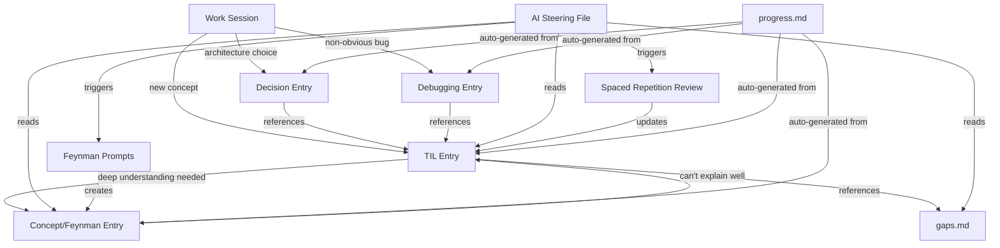

# Research: File-Based Personal Learning System

## Summary

This document researches how to design a markdown-based learning system that lives alongside project code, auto-loads into AI assistant sessions, and helps a software engineer learn while building. The system draws from five proven approaches: TIL repos, digital gardens, Zettelkasten, engineering notebooks, and Karpathy's LLM wiki pattern. The goal is a practical system that teaches without creating busywork.

The key insight across all research: **the best learning systems are byproducts of real work, not separate activities**. Every file in this system should either be created naturally during development or generated automatically by the AI assistant.

---

## Prior Art: What Works and Why

### 1. TIL (Today I Learned) Repos

The gold standard is [jbranchaud/til](https://github.com/jbranchaud/til) - 14.1k stars, 1,775 entries, 2,259 commits over a decade. Structure:

```
til/
  javascript/
    check-if-something-is-an-array.md
    destructuring-the-rest-of-an-array.md
  git/
    checkout-previous-branch.md
    cherry-pick-a-range-of-commits.md
  README.md  (auto-generated index with categories + counts)
```

What makes it work:
- One concept per file, 5-20 lines each
- Organized by technology/topic (flat folders)
- README auto-generated as a table of contents
- Low friction - just write and commit
- Josh Branchaud wrote about this in "How I Built a Learning Machine" - the key is consistency over quality

Other notable TIL repos: [thoughtbot/til](https://github.com/thoughtbot/til), [jwworth/til](https://github.com/jwworth/til), [Simon Willison's TIL](https://til.simonwillison.net/) (uses SQLite + Datasette for search).

Simon Willison's approach is interesting because he builds the TIL entries into a searchable SQLite database, making them queryable. For our system, the AI assistant serves the same role - it can search and retrieve TIL entries contextually.

**Takeaway for our system**: TIL entries are the atomic unit. One concept, one file, minimal friction. Category folders by topic.

### 2. Digital Garden / Zettelkasten

Digital gardens are "always work in progress" knowledge collections. Unlike blogs (polished, chronological), gardens are interconnected, imperfect, and evolving.

Zettelkasten (German: "slip box") principles:
- **Atomic notes**: One idea per file
- **Autonomous**: Each note makes sense on its own
- **Linked**: Notes connect to each other via `[[wiki-links]]`
- **No rigid hierarchy**: Connections matter more than folders

Three note types in Zettelkasten:
1. **Fleeting notes** - quick captures during work (our TIL entries)
2. **Literature notes** - summaries of what you read/learned from docs (our concept explanations)
3. **Permanent notes** - your own understanding in your own words (our Feynman explanations)

**Takeaway for our system**: Use wiki-style links between entries. Let the AI assistant suggest connections. Don't over-organize - connections emerge naturally.

### 3. Karpathy's LLM Wiki Pattern (2026)

Andrej Karpathy's approach (16M views on X, 5K+ GitHub stars) is the most relevant to our use case:

```
knowledge-base/
  raw/           # Unprocessed source material
  wiki/          # LLM-compiled structured articles
  index.md       # Master index with cross-references
```

Key principles:
- **Raw sources in, compiled wiki out** - the LLM processes raw notes into structured knowledge
- **Incremental compilation** - add new raw material, LLM updates the wiki
- **Persistent knowledge** - unlike chat, the wiki compounds over time
- **Indexes and relationship mapping** - the LLM maintains cross-references
- Uses markdown files in Obsidian, processed by Claude Code

This is exactly what we want: the AI assistant reads your learning files, teaches you contextually, and helps maintain the knowledge base as a byproduct of working together.

**Takeaway for our system**: The AI assistant should both read from and write to the learning system. Raw work notes get compiled into structured knowledge.

### 4. Engineering Notebooks / Diaries

[WorkLedger](https://about.workledger.org/) is a modern engineering notebook with templates:
- Decision Log
- Debugging Session
- Meeting Notes
- Learning Log
- End of Day

Traditional engineering notebooks track:
- What you tried and why
- What worked and what didn't
- Decisions and their rationale
- Sketches and diagrams

**Takeaway for our system**: Decision logs and debugging journals are high-value learning artifacts. They capture the "why" that code alone doesn't show.

### 5. CLAUDE.md / AGENTS.md Pattern

The emerging standard for AI context files:
- Markdown files auto-loaded into every AI session
- Contain project rules, conventions, and knowledge the AI can't infer from code
- Four-tier memory hierarchy: ephemeral, session, project, archive
- Human-written docs improve AI success ~4% over LLM-generated ones

This is the delivery mechanism for our learning system. Files placed in the right location get auto-loaded, making the AI a contextual tutor.

**Takeaway for our system**: Use the steering file pattern (frontmatter with `inclusion: auto`) to auto-load learning context into AI sessions.

---

## Learning Techniques: How to Integrate Them

### Active Recall

What it is: Retrieving information from memory rather than passively re-reading it. Proven to be 50-150% more effective than re-reading.

How to integrate without busywork:
- The AI assistant asks "Can you explain X?" when it detects you're using a concept you recently learned
- Quiz-style prompts embedded in learning files that the AI can surface
- "What did you learn?" prompts at end of coding sessions (already in our workflow via daily log)

File format:
```markdown
# React useEffect Cleanup

## Quick Answer
<!-- AI surfaces this as a quiz: "What happens when useEffect returns a function?" -->
The returned function runs before the component unmounts AND before the effect re-runs.

## Why It Matters
Memory leaks from subscriptions, timers, event listeners.

## Example
...
```

### Spaced Repetition

What it is: Reviewing material at increasing intervals (1 day, 3 days, 7 days, 14 days, 30 days). Based on Ebbinghaus's forgetting curve.

How to integrate without busywork:
- Each TIL entry gets a `last_reviewed` and `review_interval` in frontmatter
- The AI assistant surfaces 2-3 entries for review during natural work pauses
- Review = the AI asks you to explain the concept, not just re-read it
- Intervals increase automatically when you explain correctly

File frontmatter:
```yaml
---
created: 2026-04-14
last_reviewed: 2026-04-14
review_interval: 1  # days until next review
confidence: 1       # 1-5 scale
tags: [react, hooks, cleanup]
---
```

Important caveat from Hacker News discussion: "For programming, most things either fall into 'you'll use it frequently enough that recalling it is easy' or 'you'll use it so infrequently, it's better to just look it up.'" Spaced repetition works best for:
- Conceptual understanding (why things work, not syntax)
- Architecture patterns and tradeoffs
- Debugging mental models
- NOT API signatures or syntax (just look those up)

### Feynman Technique

What it is: Explain a concept as if teaching it to someone with no background. If you can't explain it simply, you don't understand it well enough. Four steps:
1. Choose a concept
2. Explain it in simple language
3. Identify gaps in your explanation
4. Simplify and use analogies

How to integrate without busywork:
- When you learn something complex, the AI asks: "Can you explain this in your own words?"
- Your explanation gets saved as a "Feynman note" - your understanding, not the docs
- The AI identifies gaps: "You explained X well but didn't mention Y - is that a gap?"
- These become the highest-value entries in your knowledge base

File format:
```markdown
# Explain: How DynamoDB Single-Table Design Works

## My Explanation
Instead of one table per entity (like SQL), you put everything in one table.
The trick is designing your partition key and sort key so that related data
lives together. Like a filing cabinet where each drawer (partition) holds
all the documents for one customer - invoices, orders, profile - sorted
by type and date.

## Gaps I Found
- I can't explain GSI overloading clearly yet
- Not sure when single-table is worse than multi-table

## Analogies That Helped
- Filing cabinet with smart drawer labels
- Library where books are shelved by reader, not by genre
```

---

## Proposed File Structure

```
docs/learning/
  README.md                    # Auto-generated index (counts, categories, progress)
  _learning-steering.md        # AI steering file (auto-loaded into sessions)
  
  til/                         # Today I Learned - atomic facts
    react/
      useeffect-cleanup.md
      suspense-error-boundaries.md
    typescript/
      discriminated-unions.md
    dynamodb/
      single-table-design-basics.md
    aws/
      cdk-removal-policies.md
  
  concepts/                    # Feynman explanations - deeper understanding
    dynamodb-single-table-design.md
    react-server-components.md
    oauth2-flow.md
  
  decisions/                   # Why we chose X over Y
    chose-dynamodb-over-postgres.md
    chose-cdk-over-sam.md
    chose-react-query-over-swr.md
  
  debugging/                   # What went wrong and how I fixed it
    cors-error-api-gateway.md
    cdk-deploy-circular-dependency.md
  
  gaps.md                      # Known unknowns - what I need to learn next
  progress.md                  # Auto-maintained by AI - stats and growth
```

### File Descriptions

| File/Dir | Purpose | Created By | Updated By |
|----------|---------|------------|------------|
| `README.md` | Index with counts per category, recent entries, review queue | AI (auto-generated) | AI (on each new entry) |
| `_learning-steering.md` | Instructions for AI on how to use the learning system | Human (once) | Human (rarely) |
| `til/` | One-concept-per-file quick learnings | Human or AI during work | Human (corrections) |
| `concepts/` | Feynman-style explanations in your own words | Human (AI prompts you) | Human (as understanding deepens) |
| `decisions/` | Architecture Decision Records (ADRs) lite | Human during design | Human (if decision changes) |
| `debugging/` | Root cause + fix for non-obvious bugs | AI (captures from session) | Human (corrections) |
| `gaps.md` | List of things you know you don't know | AI (detects from questions) | Human (marks as learned) |
| `progress.md` | Stats: entries per week, categories, review scores | AI (auto-maintained) | AI |

---

## The Steering File: How AI Uses the Learning System

This is the most important file. It tells the AI assistant how to interact with the learning system during work sessions.

```markdown
---
inclusion: auto
name: project-learning
description: Personal learning system for the project. Load when working on code,
  reviewing, debugging, or discussing architecture.
---

# Learning System

## For the AI assistant

You are both a coding partner and a contextual tutor. During work sessions:

### Passive behaviors (always on)
- When the user asks about a concept, check til/ and concepts/ first
- If a relevant TIL exists, reference it: "You learned about this on [date] - [link]"
- If the user struggles with something they previously learned, note it in gaps.md

### Active behaviors (triggered by context)
- After fixing a non-obvious bug: "Want me to save this as a debugging entry?"
- After making an architecture decision: "Should I capture this decision and the alternatives?"
- When using a new API/pattern for the first time: "New concept - want a TIL entry?"
- At session end: "You worked with [X, Y, Z] today. Any new learnings to capture?"

### Spaced repetition (2-3 per session, max)
- Check til/ entries where today >= last_reviewed + review_interval
- Ask the user to explain the concept (don't just show it)
- If they explain well: double the review_interval, bump confidence
- If they struggle: reset review_interval to 1, note gap

### Feynman prompts (when appropriate)
- When the user uses a concept they haven't written a concepts/ entry for
- "You've been using [X] a lot - can you explain how it works in your own words?"
- Save their explanation, identify gaps, suggest improvements

### What NOT to do
- Don't interrupt flow state with learning prompts
- Don't create entries for trivial things (syntax, typos)
- Don't quiz during debugging or incident response
- Keep it to 2-3 learning interactions per session max
```

---

## Entry Templates

### TIL Entry

```markdown
---
created: YYYY-MM-DD
last_reviewed: YYYY-MM-DD
review_interval: 1
confidence: 1
tags: [category, subcategory]
---

# Title: One-Line Description

## What
[2-3 sentences explaining the concept]

## Example
[Code snippet or concrete example]

## Source
[Link to docs, article, or "discovered while working on X"]
```

### Concept (Feynman) Entry

```markdown
---
created: YYYY-MM-DD
last_reviewed: YYYY-MM-DD
confidence: 1
tags: [category]
related: [link-to-til-1, link-to-til-2]
---

# Explain: [Concept Name]

## My Explanation
[Explain it like you're teaching a teammate who's never seen this before.
No jargon. Use analogies.]

## Why It Matters
[When would you use this? What problem does it solve?]

## Gaps
- [ ] [Things you can't explain yet]
- [ ] [Questions you still have]

## Analogies
- [Analogy 1]
- [Analogy 2]
```

### Decision Entry

```markdown
---
created: YYYY-MM-DD
tags: [architecture, database]
status: active  # active | superseded | revisiting
---

# Decision: [What We Chose]

## Context
[What problem were we solving?]

## Options Considered
1. **[Option A]** - [pros] / [cons]
2. **[Option B]** - [pros] / [cons]

## Decision
[What we chose and why]

## Consequences
[What this means for the project going forward]
```

### Debugging Entry

```markdown
---
created: YYYY-MM-DD
tags: [service, error-type]
time_to_fix: [minutes]
---

# Debug: [Short Description of the Bug]

## Symptoms
[What you saw - error messages, unexpected behavior]

## Root Cause
[What was actually wrong]

## Fix
[What you changed]

## How to Recognize This Next Time
[The signal that points to this root cause]
```

---

## How Files Connect



The flow is:
1. You work on the project normally
2. The AI detects learning moments and offers to capture them
3. TIL entries accumulate as atomic facts
4. When you use a concept enough, the AI prompts a Feynman explanation
5. Spaced repetition surfaces old entries for review
6. gaps.md tracks what you still need to learn
7. progress.md shows your growth over time

---

## Progress Tracking and Gap Detection

### progress.md (auto-maintained)

```markdown
# Learning Progress

## Stats
- Total TIL entries: 47
- Concept explanations: 8
- Decisions documented: 5
- Debugging entries: 12
- Last entry: 2026-04-14

## By Category
| Category | TILs | Concepts | Confidence Avg |
|----------|------|----------|----------------|
| React | 12 | 3 | 3.2 |
| TypeScript | 8 | 1 | 2.8 |
| DynamoDB | 6 | 2 | 2.1 |
| AWS/CDK | 5 | 1 | 1.9 |
| CSS | 4 | 0 | 3.5 |

## Review Queue (due today)
- [ ] til/react/useeffect-cleanup.md (last: 7 days ago, confidence: 3)
- [ ] til/dynamodb/single-table-design-basics.md (last: 3 days ago, confidence: 2)

## Knowledge Gaps
- DynamoDB GSI overloading (mentioned in 3 entries, no concept file)
- OAuth2 refresh token flow (asked about 2x, no TIL)
- CDK custom constructs (used but never documented)

## Weekly Trend
- Week 15: +5 TILs, +1 concept, +2 debugging
- Week 14: +3 TILs, +0 concepts, +1 debugging
- Week 13: +8 TILs, +2 concepts, +0 debugging
```

### gaps.md

```markdown
# Knowledge Gaps

Things I know I don't know. The AI adds items here when it detects
I'm struggling or asking repeated questions about a topic.

## Active Gaps
- [ ] DynamoDB GSI overloading - when and why to use it
- [ ] React Server Components vs Client Components - when to use which
- [ ] AWS IAM policy conditions - beyond basic Allow/Deny

## Resolved (moved to TIL or Concepts)
- [x] React Suspense boundaries - see concepts/react-suspense.md
- [x] CDK removal policies - see til/aws/cdk-removal-policies.md
```

---

## Implementation Plan

### Phase 1: Bootstrap (Day 1)
1. Create `docs/learning/` directory structure
2. Create `_learning-steering.md` with AI instructions
3. Create empty `gaps.md` and `progress.md`
4. Create 3-5 TIL entries from things already learned during project setup

### Phase 2: Natural Growth (Ongoing)
- AI offers to capture learnings during work sessions
- TIL entries accumulate naturally
- Decisions get documented as they're made
- Debugging entries saved after non-obvious fixes

### Phase 3: Deepening (After ~20 TIL entries)
- AI starts prompting Feynman explanations for frequently-used concepts
- Spaced repetition kicks in for entries older than 3 days
- Gap detection identifies patterns in what you're struggling with

### Phase 4: Compounding (After ~50 TIL entries)
- Cross-references between entries become valuable
- Progress tracking shows growth trajectory
- Knowledge gaps guide what to learn next
- The system becomes a personal reference that's faster than Google

---

## Anti-Patterns to Avoid

1. **Don't create entries for everything** - Only capture things that surprised you, confused you, or that you'd want to remember. If it's in the first page of the docs, skip it.

2. **Don't over-organize** - Start with flat folders. Add structure only when you have 20+ entries in a category. Premature organization kills momentum.

3. **Don't make it a chore** - If capturing a learning takes more than 2 minutes, the system is too heavy. The AI should do most of the formatting.

4. **Don't review too aggressively** - 2-3 spaced repetition prompts per session max. Learning should feel like a natural part of work, not an interruption.

5. **Don't duplicate the docs** - TIL entries should capture YOUR understanding and context, not restate official documentation. "I learned that useEffect cleanup runs before re-render, which matters because..." not "useEffect accepts a function that..."

6. **Don't track syntax** - Spaced repetition for `array.filter()` syntax is pointless. Track mental models, tradeoffs, and "why" knowledge.

---

## Sources

- [jbranchaud/til](https://github.com/jbranchaud/til) - accessed 2026-04-14
- [How I Built a Learning Machine](https://dev.to/jbranchaud/how-i-built-a-learning-machine-45k9) - accessed 2026-04-14
- [Simon Willison's TIL](https://til.simonwillison.net/) - accessed 2026-04-14
- [Setting up Simon's TIL](https://remysharp.com/2020/05/02/setting-up-simons-til) - accessed 2026-04-14
- [MaggieAppleton/digital-gardeners](https://github.com/MaggieAppleton/digital-gardeners) - accessed 2026-04-14
- [Zettelkasten Method: Unlock Better Thinking](https://www.affine.pro/blog/zettelkasten-method) - accessed 2026-04-14
- [My Neovim Zettelkasten](https://mischavandenburg.com/zet/neovim-zettelkasten/) - accessed 2026-04-14
- ⚠️ External link - [Feynman Technique for Learning Programming](https://snappify.com/blog/feynman-learning-technique) - accessed 2026-04-14
- ⚠️ External link - [Supercharge Learning to Code with the Feynman Technique](https://dev.to/rwparrish/supercharge-learning-to-code-with-the-feynman-technique-502o) - accessed 2026-04-14
- ⚠️ External link - [How I used SRS to learn programming concepts 2x Faster](https://medium.com/learning-how-to-code/using-spaced-repetition-software-to-learn-programming-concepts-e1cbf4ee6f12) - accessed 2026-04-14
- ⚠️ External link - [Anki for Developers](https://dasroot.net/posts/2025/12/spaced-repetition-for-technical/) - accessed 2026-04-14
- ⚠️ External link - [Cost-Effective Personal Knowledge System with Claude Code](https://www.geeky-gadgets.com/claude-code-markdown-wiki/) - accessed 2026-04-14
- ⚠️ External link - [Karpathy's LLM Knowledge Base](https://ghost.codersera.com/blog/karpathy-llm-knowledge-base-second-brain/) - accessed 2026-04-14
- ⚠️ External link - [I Built a Knowledge Base That Writes Itself](https://fabswill.com/blog/building-a-second-brain-that-compounds-karpathy-obsidian-claude/) - accessed 2026-04-14
- [WorkLedger - Engineering Notebook](https://about.workledger.org/) - accessed 2026-04-14
- [How to Start Your Engineering Diary](https://stingy-wedge-8a2.notion.site/engineering-diary) - accessed 2026-04-14
- ⚠️ External link - [How to Build Your AGENTS.md](https://www.augmentcode.com/guides/how-to-build-agents-md) - accessed 2026-04-14
- ⚠️ External link - [AGENTS.md becomes the convention](https://pnote.eu/notes/agents-md/) - accessed 2026-04-14
- ⚠️ External link - [How to Build Your Own Claude Code Skill](https://www.freecodecamp.org/news/how-to-build-your-own-claude-code-skill/) - accessed 2026-04-14
- ⚠️ External link - [Spaced Repetition discussion on HN](https://news.ycombinator.com/item?id=32213729) - accessed 2026-04-14
